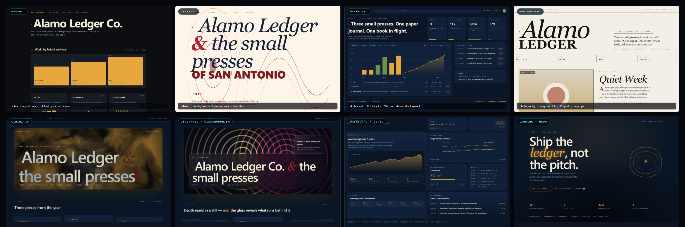
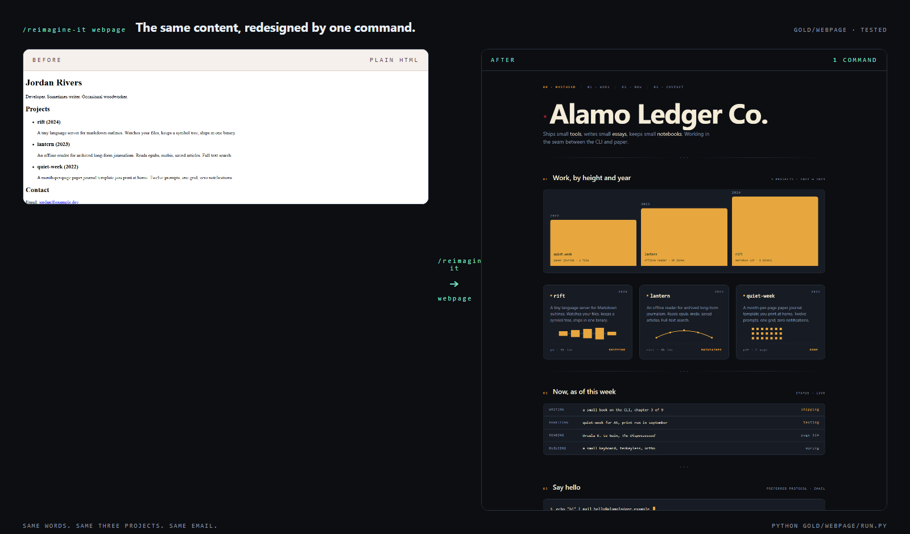
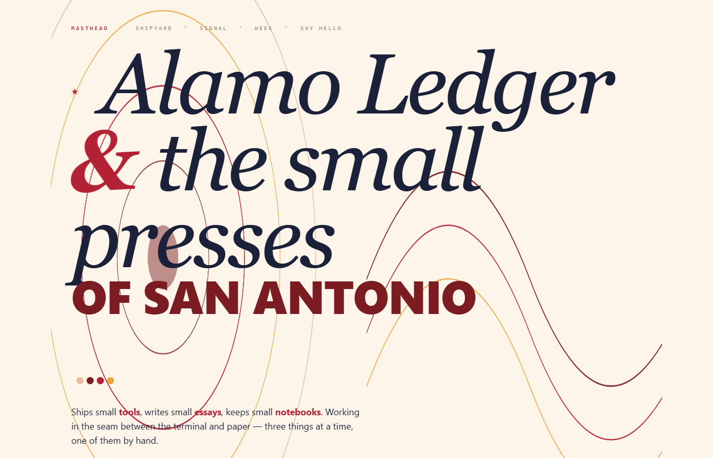
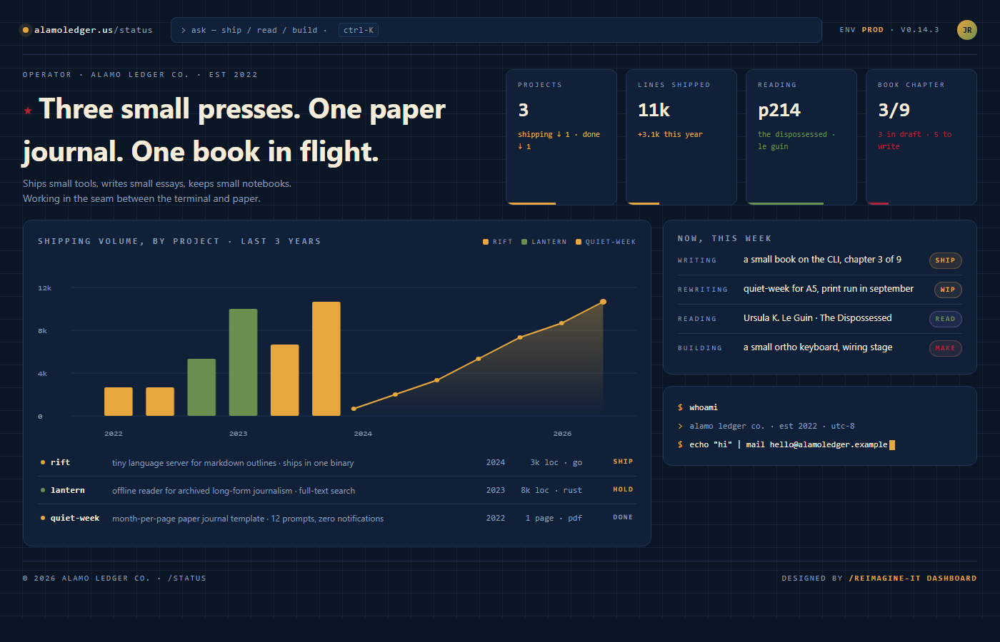
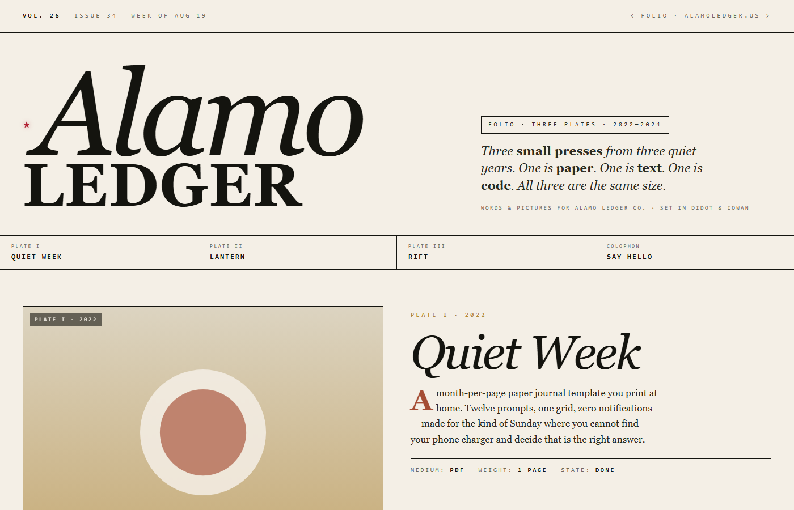
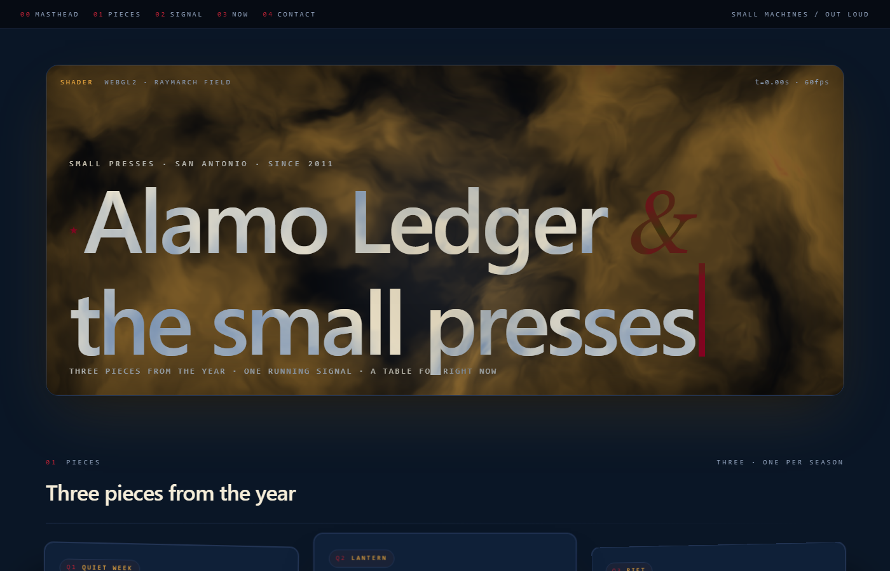
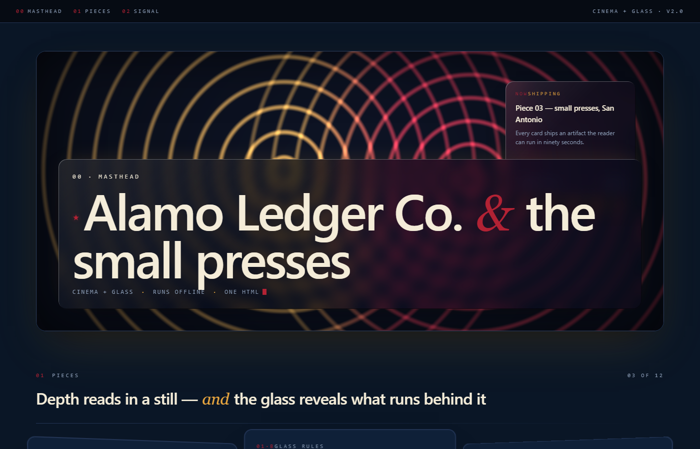
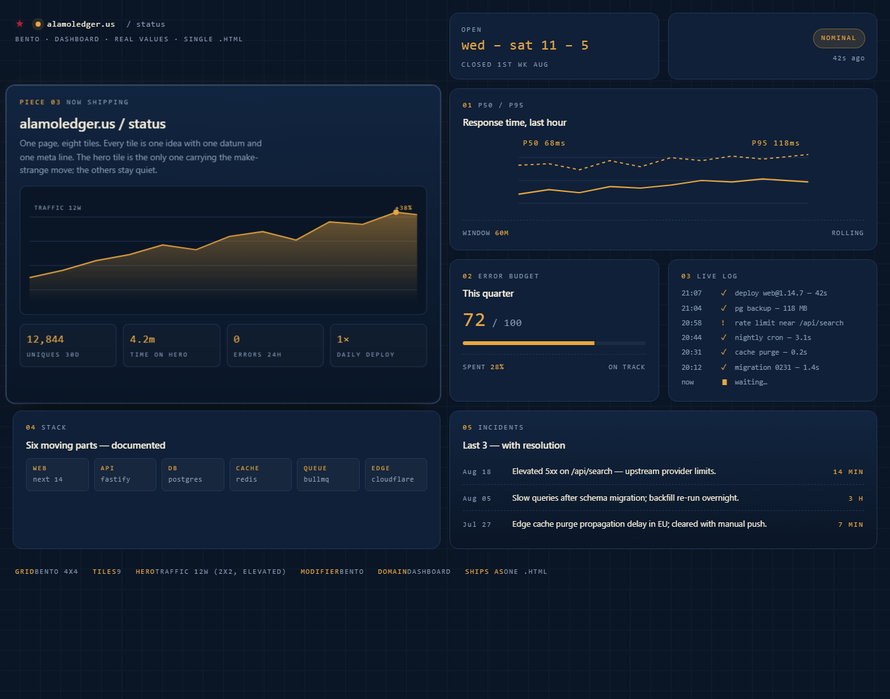
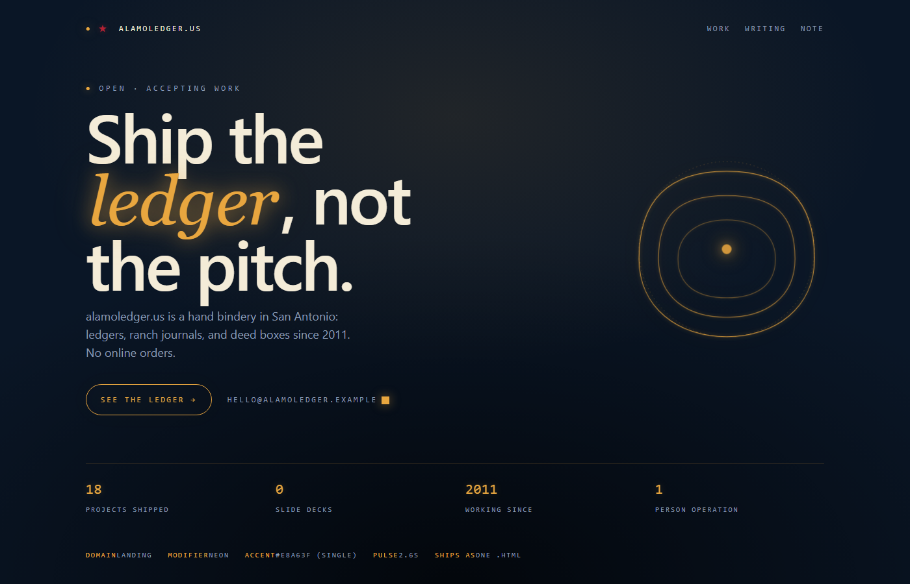
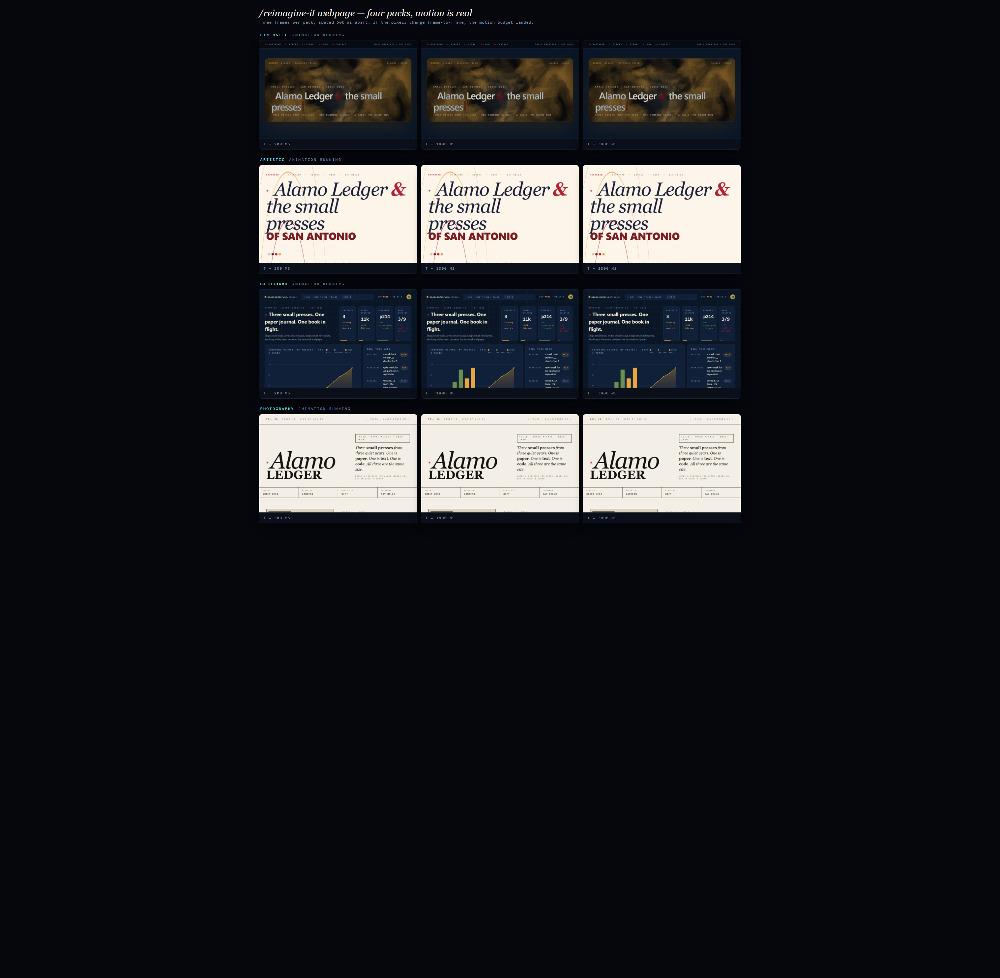

# reimagine-it

[](LICENSE) [](https://agentskills.io/specification) [](skills/reimagine-it/SKILL.md)

> Same brief, radically different output. One agent skill that takes any file — a webpage, PDF, deck, doc, CLI, protocol, prose — and ships a leap the user didn't know to ask for. Every shot below is rendered locally from a real `.html` file in this repo. No CDN, no paid API, no third-party service.



```
/reimagine-it webpage                                        <- default (top-left)
/reimagine-it webpage artistic
/reimagine-it webpage dashboard
/reimagine-it webpage photography
/reimagine-it webpage cinematic                              <- inline WebGL2 shader
/reimagine-it webpage cinematic glassmorphism                <- modifier stacks on domain
/reimagine-it webpage dashboard bento
/reimagine-it webpage landing   neon
```

---

## Install

```bash
npx skills add kazimrmerchant/reimagine-it            # one project
npx skills add kazimrmerchant/reimagine-it -g          # global (Cursor, Claude Code, ...)
```

Then say `/reimagine-it` in your host.

---

## The five levers

| Lever | Syntax | Effect |
|-------|--------|--------|
| **Form** | `webpage` · `pdf` · `slides` · `document` · `code` · `cli` · `protocol` · ... | Force the medium. |
| **Domain** | `webpage artistic` · `dashboard` · `photography` · `cinematic` · `landing` · `portfolio` | Force the aesthetic. See [`references/domains/`](skills/reimagine-it/references/domains/). |
| **Modifier** | `webpage cinematic glassmorphism` · `bento` · `neon` · `brutalism` · `neumorphism` · `handdrawn` | Layer a UI/UX style on any domain. See [`references/modifiers/`](skills/reimagine-it/references/modifiers/). |
| **Font** | `--font "Playfair Display, Iowan Old Style, Georgia, serif"` | Pin display / body family. Full stack. No webfont fetch unless `--allow-fetch`. |
| **Lock** | `lock <path> as <name>` then `--ref <name>` | Capture design DNA (palette, type, motifs, motion, 3D) and reuse it — even across media. |

Compose freely: `/reimagine-it webpage artistic glassmorphism --font "Playfair Display, serif" --ref house-cinema`.

---

## Domains — same brief, different aesthetic

Every hero below is a real `.html` file in `gold/`. Open one, double-click it, screenshot it — the pixels in this README came out of exactly that.

### Default spine (no domain)



Grid + baseline + palette cap + one motif + one make-strange move. Source: [`gold/webpage/before.html`](gold/webpage/before.html) → [`gold/webpage/after.html`](gold/webpage/after.html).

### `artistic` — cream, italic serif, drifting arcs, real 3D card fan



Kinetic italic ampersand sways ±3°. Hero-scale drifting SVG arcs behind the type. Cards fan at real ±16° with a 40 px drop-shadow — depth reads in a still, not just on hover. [`gold/domains/artistic/after.html`](gold/domains/artistic/after.html).

### `dashboard` — operator grid, KPI tiles, live SVG chart, terminal



Faint 32 px operator grid on the body. KPI tiles across the top. Live SVG traffic chart with a rising-bar animation and a pulsing accent dot. Status pills. Blinking-caret terminal card. [`gold/domains/dashboard/after.html`](gold/domains/dashboard/after.html).

### `photography` — magazine folio, SVG plates, dropcaps



Didot-scale italic-then-caps nameplate. Numbered plate strip. Three real SVG "photographs" (not stock). Dropcap paragraphs. Deliberately quiet motion — a folio doesn't twitch. [`gold/domains/photography/after.html`](gold/domains/photography/after.html).

### `cinematic` — inline WebGL2 shader hero, single file, no CDN



Inline `<canvas>` + inline fragment shader in a `<script type="x-shader/x-fragment">` block. No CDN, no `import` from `https://`, no vendor folder. Masthead sits *on top* of the shader with `mix-blend-mode: difference` so type reads over any color the field draws. Cards below the hero fan in real 3D (`perspective:1400px`, outer cards `rotateY(±9deg) translateZ(-8px)`, middle `translateZ(30px)` + 60 px shadow). [`gold/domains/cinematic/after.html`](gold/domains/cinematic/after.html). Aliases: `3d`, `webgl`.

---

## Modifiers — layer a UI/UX style on any domain

Modifiers **compose** on top of any domain pack. They waive matching cut-list entries and add their own non-negotiables (real substrate, two blur tiers, light-source-consistent borders, glow budgets).

### `cinematic` + `glassmorphism` — two blur tiers over a running shader



The shader keeps running. Glassmorphism layers a **front tier** (14 px blur) over the masthead and a **deep tier** (24 px blur, top-right) over a data tile. Both panels have light-source-consistent borders (bright top-left inset, dark bottom-right inset) and colored `box-shadow`s. Blur **reveals** the substrate; it never covers a solid color. [`gold/modifiers/cinematic-glassmorphism/after.html`](gold/modifiers/cinematic-glassmorphism/after.html).

### `dashboard` + `bento` — named-cell grid, hero tile 2x2 elevated



CSS Grid with `grid-template-areas`: `"brand brand hours state" "hero hero chart chart" "hero hero latency logs" "stack stack incidents incidents"`. Nine tiles, unequal but shared chrome (same radius, border, padding). Hero tile visibly elevated (`translateZ(24px)` + 40 px shadow). One idea per tile. [`gold/modifiers/dashboard-bento/after.html`](gold/modifiers/dashboard-bento/after.html).

### `landing` + `neon` — one glowing accent doing all the work



Dark void with a single radial-gradient vignette. **One** high-chroma accent (`#e8a63f`) doing every emotional job: the italic *ledger* word (kinetic — pulses letter-spacing on a 4 s cycle), the orbital SVG that draws itself on load, the CTA border, the blinking cursor. Glow via double `drop-shadow`. Everything else stays quiet so the accent reads as light in a room. [`gold/modifiers/landing-neon/after.html`](gold/modifiers/landing-neon/after.html).

---

## Motion is real (three frames per pack)

Screenshots freeze animation, so every claim about motion proves itself in a strip. Three frames per pack, spaced ~1.6 s apart in virtual time — if the pixels change, the motion budget landed:



- **cinematic** — WebGL2 raymarch field evolves visibly frame to frame.
- **artistic** — italic ampersand sways ±3°.
- **dashboard** — chart bars rise into place between frames.
- **photography** — deliberately still.

---

## Not just webpages — PDF · document · slides · anything

Point at any file. Force any output:

| Token | Pack | Regenerator |
|-------|------|-------------|
| `pdf` | [forms/pdf.md](skills/reimagine-it/references/forms/pdf.md) | Weasyprint (HTML → PDF) or ReportLab (print-native Python) |
| `document` / `docx` / `md` | [forms/document.md](skills/reimagine-it/references/forms/document.md) | python-docx, pandoc, or LaTeX |
| `slides` / `pptx` / `deck` | [forms/slides.md](skills/reimagine-it/references/forms/slides.md) | python-pptx or reveal.js |
| `universal` | [forms/universal.md](skills/reimagine-it/references/forms/universal.md) | Detects file type, dispatches, or writes a companion overlay |

Every non-web pack keeps the same bar: cover magnet, one data-driven plate, one repeating motif, one make-strange move, real content from *your* file. All regenerators are free, offline, locally installable.

---

## Lock — capture a shipped design, reuse it anywhere

Once a design lands, save its DNA:

```
/reimagine-it lock gold/domains/cinematic/after.html as house-cinema
```

The skill extracts palette + type stack + motifs + motion + 3D + section structure into a markdown pack under [`references/locks/`](skills/reimagine-it/references/locks/). Example: [`house-cinema.md`](skills/reimagine-it/references/locks/house-cinema.md).

Apply a lock to a new target — **same medium or a different one**:

```
/reimagine-it webpage --ref house-cinema
/reimagine-it slides  --ref house-cinema
/reimagine-it pdf     --ref house-cinema
```

Locks include a **cross-medium translation table** so a webpage lock informs a slides deck or a PDF (a `rotateY(9deg) translateZ(-8px)` card becomes a pptx panel with paired shadows; a WebGL shader hero becomes a snapshot PNG cover). Locks are portable text — share via gist, commit, or copy-paste.

---

Reshoot everything locally: `python gold/gallery.py`. MIT licensed — see [LICENSE](LICENSE).
