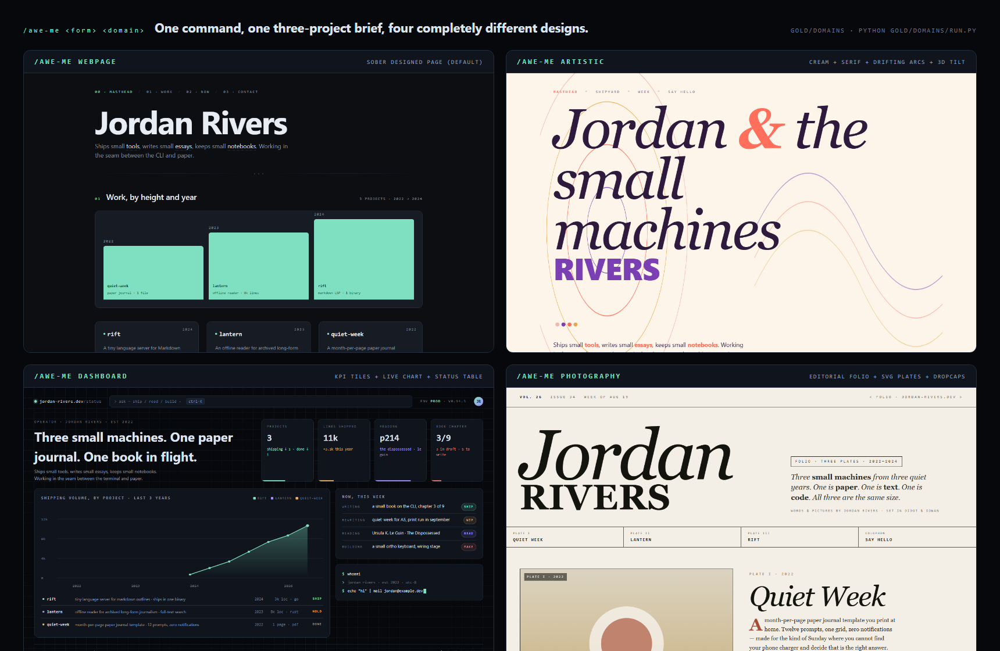

# reimagine-it

[](LICENSE) [](https://github.com/Kayforkind/reimagine-it/actions/workflows/audit.yml) [](https://skills.sh/kayforkind/reimagine-it) [](https://code.claude.com/docs/en/plugins) [](https://cursor.com) [](https://github.com/openai/codex) [](https://agentskills.io/specification) [](skills/reimagine-it/SKILL.md) [](https://github.com/sponsors/Kayforkind)

**This is an agent skill — an AI reads your file and redesigns it from its own content. Not a mood board. A real artifact.**

Same naive HTML. Completely different pages — webpage, infographic poster, living SVG, Three.js room, playable simulation. One file. Offline. No Figma, no CDN.


**[Live gallery](https://kayforkind.github.io/reimagine-it/)** — browse the gold. No install. Or **[try the playground](https://kayforkind.github.io/reimagine-it/#playground) — paste HTML, see a live redesign in your browser right now.

---

## One command

```text
# Claude Code
/plugin marketplace add Kayforkind/reimagine-it
/plugin install reimagine-it@reimagine-it

# Cursor, Codex, Copilot, Gemini CLI
npx skills add Kayforkind/reimagine-it
```

Then in your AI agent: `/reimagine-it` · `/reimagine-it infographic` · `/reimagine-it svg` · `/reimagine-it 3js` · `/reimagine-it simulation`

| Token | What you get |
|-------|----------------|
| `webpage` | A real page from this file's nouns, dates, colors |
| `infographic` | A paper poster of facts already in the file — not a fake dashboard |
| `svg` | A living mark (the motion is on the drawing) |
| `3js` | A room you can orbit |
| `simulation` | A playable model of those facts |

Full host matrix (Droid, Pi, `gh skill`, Gemini CLI, Windsurf): [install guide ↓](#install).

---

## How it works

The skill reads your file, extracts concrete nouns / dates / colors / proper nouns, and builds a design language from them. **Palette, motifs, motion, and 3D are all derived from your content — nothing is hard-coded.**

- Point at a **Texas notebook** → navy / cream / red / gold palette, Lone Star motif, sunset shader
- Point at a **coffee roaster's site** → warm browns, burlap textures, roast-level charts
- Point at a **night-diving report** → deep teals, bioluminescent accents, depth-profile SVG
- Point at a **restaurant menu** → warm clay / saffron / smoke palette; flame-flicker motion

**Same command, three runs = three different reader registers.** The engine samples along seven axes (reader register, palette weighting, hero move, plate style, motion budget, type accent, 3D signature). The content narrows the space — a Texas notebook can't return a marine-caustics shader — but inside that space, every draw is fresh. Pin with `--seed` when you need reproducibility.


---

## Same source, different aesthetics

One naive HTML page. Eight commands. Eight completely different designs — each palette, motif, and motion choice traced back to the content:



**[→ Full case studies with palette/motif/motion/3D notes for all 13 commands](docs/SHOWCASE.md)**

---

## Five sources — the method travels

The gallery is proof the method works on any content, not a Texas demo:

<a href="gold/webpage/before.html"></a>

**Texas notebook** — 3 places, 3 signals, Lone Star flag, Big Bend sunset. Navy / cream / red / gold palette from the flag; sunset shader from Big Bend. → [see the gold](gold/webpage/after-3.html)

<a href="gold/jules/before.html"></a>

**Jules Ice Cream** — 6 flavors, hours, counter. Parlor DNA — counter, cone, freezer, flavor board. Not a Texas notebook with scoops glued on. → [see the gold](gold/jules/webpage/after.html)

| Source | Genre | Palette from content | Motif | Links |
|--------|-------|---------------------|-------|-------|
| [Pulsewave](gold/pulsewave/before.html) | SaaS observability | `#08141a` ground · `#3ae098` accent · dark teal | Pulse wave / heartbeat ring | [before](gold/pulsewave/before.html) · [after](gold/pulsewave/after.html) |
| [Two Lights](gold/twolights/before.html) | Personal essay | `#e8e0d4` ground · `#c23a2a` accent · slate | Lighthouse beam sweep + flash pulse | [before](gold/twolights/before.html) · [after](gold/twolights/after.html) |
| [Saffron &amp; Smoke](gold/saffron/before.html) | Restaurant menu | `#f4efe4` ground · `#d4882b` accent · warm clay | Smoke drift + flame flicker | [before](gold/saffron/before.html) · [after](gold/saffron/after.html) |

Three new golds proving the palette/motif/motion method works on any content. → [see all gold](gold/)

---

## Motion is real

Screenshots freeze animation. Every motion claim proves itself in three frames, spaced ~1.6 s apart:


**Alive-micro by default.** SVG and Three.js ship with 2–4 fact-tied micro-loops — star breathe, river flow, pin ping, beam sweep. Not a page that twitches. → [see the loops](gold/forms/see.html)

---

## No agent? Just curious?

The **[live gallery](https://kayforkind.github.io/reimagine-it/)** has a playground — paste any HTML, pick a token, and see a content-derived redesign rendered live in your browser. The client-side engine extracts nouns, colors, dates, and numbers from your source, builds a palette, and generates a token-specific page. Same method. No install. No agent.

**[→ Open the playground](https://kayforkind.github.io/reimagine-it/#playground)**


---

## Not just webpages — also CLI, protocol, code architecture

The five golds above are webpages. The same method works on non-visual artifacts too:

| Fixture | Form | What /reimagine-it did | Proof |
|---------|------|------------------------|-------|
| [01-cli](gold/five/01-cli) | `cli` | Before: reads one positional arg, exits 2 with no stdin. After: `--stdin` flag, JSON output, exit 0 on piped data | `python gold/five/run.py` |
| [02-door](gold/five/02-door) | `protocol` | Before: first-run exits 1 with a wall of text. After: copies one command to clipboard, exits 0 | `python gold/five/run.py` |
| [03-ledger](gold/five/03-ledger) | `html` + data | Before: 30 lines of naive JSONL. After: filterable index.html with SVG timeline | [index.html](gold/five/03-ledger/index.html) · [RUN.svg](gold/five/RUN.svg) |
| [04-layers](gold/five/04-layers) | `code` architecture | Two Python packages with tangled internal imports → clean public-internal split with a layer-check script | `python gold/five/run.py` |

[Full tested results →](gold/five/RESULTS.md) · Regenerate: `python gold/five/run.py`

---

## Install

One chair: `skills/reimagine-it/`. Hosts with a plugin marketplace get a native wrapper in this repo. Hosts that only speak Agent Skills install the same folder.

**Claude Code**

```text
/plugin marketplace add Kayforkind/reimagine-it
/plugin install reimagine-it@reimagine-it
```

Then enable updates: `/plugin` → **Marketplaces** → **reimagine-it** → **Enable auto-update**. Run `/reload-plugins` when prompted.

**Codex**

```bash
codex plugin marketplace add Kayforkind/reimagine-it
codex plugin add reimagine-it@reimagine-it
```

**Factory Droid**

```bash
droid plugin marketplace add https://github.com/Kayforkind/reimagine-it
droid plugin install reimagine-it@reimagine-it --scope user
```

**Cursor, Copilot, Gemini CLI, Windsurf**

```bash
npx skills add Kayforkind/reimagine-it             # one project
npx skills add Kayforkind/reimagine-it -g           # global
gh skill install Kayforkind/reimagine-it reimagine-it --agent cursor
gemini skills install https://github.com/Kayforkind/reimagine-it.git --path skills/reimagine-it
```

**Pi**

```bash
pi install https://github.com/Kayforkind/reimagine-it
```

Then say `/reimagine-it` in the host. Also matches: "reimagine it", "redesign this page", "make an infographic".

---

## The five levers

| Lever | Syntax | Effect |
|-------|--------|--------|
| **Form** | `webpage` \| `svg` \| `3js` \| `simulation` \| `pdf` \| `slides` \| `document` \| `mobi` \| `epub` \| `code` \| `cli` \| `protocol` \| ... | Force the medium. `svg` and `3js` are **alive by default** (2–4 fact-tied micro-loops). Leftover `still` / `no-motion` / `print` freezes them. |
| **Domain** | `webpage artistic` \| `dashboard` \| `photography` \| `cinematic` \| `landing` \| `portfolio` \| `infographic` | Force the aesthetic. `infographic` is a statistical poster (common-scale encodings + ISOTYPE + data table), not an ops dashboard. See [`references/domains/`](skills/reimagine-it/references/domains/). |
| **Modifier** | `webpage cinematic glassmorphism` \| `bento` \| `neon` \| `brutalism` \| `neumorphism` \| `handdrawn` <br><sub>*brutalism/neumorphism/handdrawn are spec-only stubs (coming in v2.4)*</sub> | Layer a UI/UX style on any domain. See [`references/modifiers/`](skills/reimagine-it/references/modifiers/). |
| **Font** | `--font "Playfair Display, Iowan Old Style, Georgia, serif"` | Pin display / body family. Full stack. No webfont fetch unless `--allow-fetch`. |
| **Lock** | `lock <path> as <name>` then `--ref <name>` | Capture design DNA (palette, type, motifs, motion, 3D) and reuse it — even across media. |

Compose freely: `/reimagine-it webpage artistic glassmorphism --font "Playfair Display, serif" --ref house-cinema`.

---

## Three hard guarantees (v2.2)

Three things that were sometimes missing before are now part of the shipped bar. If any fails, the command reports `partial`, not `shipped`.

- **Same-format twin by default.** Point at a distributable file (`.pdf`, `.docx`, `.pptx`, `.mobi`, `.azw3`, `.epub`, `.md`) and get **two artifacts**: a companion HTML reading room *and* a same-format twin in the source's native format. If the toolchain is missing, the report names it and the exact next command.
- **Visual verification pass on every render.** Before `shipped`, the skill scans for blank plates, placeholder labels (`blank` / `TBD` / `lorem`), clipped text, broken SVGs, off-palette accents, fabricated content, dead motion, and unmapped plates. **Empty slots are deleted, never painted with a placeholder.**
- **Craft floor on every webpage output.** Every page clears: `:focus-visible` ring with contrast ≥ 3:1, `::selection` on-palette, compositor-only motion (`transform` / `opacity` only), `prefers-reduced-motion` respected by *decomposing* (not by hiding focus rings), no `transition: all`, no `outline: 0` without replacement, scroll-driven animations via `animation-timeline: view()`, Core Web Vitals sane. See [`references/craft-floor.md`](skills/reimagine-it/references/craft-floor.md).

All three enforced by [`SKILL.md`](skills/reimagine-it/SKILL.md) § 2.6 / § 5.b / § 5.c and [`references/forms/universal.md`](skills/reimagine-it/references/forms/universal.md).

---

## Not just webpages — PDF · document · slides · anything

Point at any file. Force any output:

| Token | Pack | Regenerator |
|-------|------|-------------|
| `pdf` | [forms/pdf.md](skills/reimagine-it/references/forms/pdf.md) | Weasyprint (HTML → PDF) or ReportLab (print-native Python) |
| `document` / `docx` / `md` | [forms/document.md](skills/reimagine-it/references/forms/document.md) | python-docx, pandoc, or LaTeX |
| `slides` / `pptx` / `deck` | [forms/slides.md](skills/reimagine-it/references/forms/slides.md) | python-pptx or reveal.js |
| `universal` | [forms/universal.md](skills/reimagine-it/references/forms/universal.md) | Detects file type, dispatches, or writes a companion overlay |

Every non-web pack keeps the same bar: cover magnet, one data-driven plate, one repeating motif, one make-strange move, real content from *your* file, **palette and motifs derived from what your file is about**. All regenerators are free, offline, locally installable.

---

## Lock — capture a shipped design, reuse it anywhere

Once a design lands, save its DNA:

```
/reimagine-it lock gold/domains/cinematic/after.html as house-cinema
```

The skill extracts palette + type stack + motifs + motion + 3D + section structure into a markdown pack under [`references/locks/`](skills/reimagine-it/references/locks/). Example: [`house-cinema.md`](skills/reimagine-it/references/locks/house-cinema.md).

```
/reimagine-it webpage --ref house-cinema
/reimagine-it slides  --ref house-cinema
/reimagine-it pdf     --ref house-cinema
```

Locks include a **cross-medium translation table** — a webpage lock informs a slides deck or a PDF. Locks are portable text — share via gist, commit, or copy-paste.

---

## Everything on this page is tested

Every visual is a real file in this repo, generated locally by a script you can rerun:

| Regenerates | Command |
|-------------|---------|
| Per-pack full-page `after.png` shots | `python gold/shots.py` |
| Infographic poster (full page, real Chrome) | `python gold/_shot_full.py gold/domains/infographic/after.html gold/domains/infographic/after.png` |
| Form gold: SVG + Three.js + simulation + loop close-ups | `python gold/forms/shot.py` |
| Form examples GIF | `python gold/forms/make_gif.py` |
| Jules second-source gold + GIF | `python gold/jules/shot.py` then `python gold/jules/make_gif.py` |
| Gold review (flag cloth, clone scan, after.png pairs) | `python scripts/review_gold.py` |
| Draw C full-page shot (v2.2, WebGL2) | `python gold/_shot_full.py gold/webpage/after-3.html gold/webpage/after-3-full.png` |
| Master gallery + per-pack tile heroes | `python gold/gallery.py` |
| Quartet + twins triptych + per-pack compares | `python gold/compare.py` |
| Default before + after screenshots | `python gold/webpage/run.py` |
| Motion strip | `python gold/domains/motion-run.py` |
| Skill smoke fixture | `python gold/reimagine.py --ship` |
| Pulsewave gold | `python gold/pulsewave/shot.py` |
| Two Lights gold | `python gold/twolights/shot.py` |
| Saffron & Smoke gold | `python gold/saffron/shot.py` |

If a regenerator fails on your machine, that's a bug — please open an issue. Nothing on this page is rendered by a third-party service or fetched from a CDN.

---

## If this helps you

If `/reimagine-it` gives you an output you'd have paid a designer for, three ways to help:

- **Star the repo.** The single fastest signal this project should keep growing.
- **[Sponsor on GitHub →](https://github.com/sponsors/Kayforkind)** Any tier keeps the studio going. Sponsors get priority on custom domain packs and roadmap input.
- **Contribute a domain or a lock.** Open a PR under [`skills/reimagine-it/references/domains/`](skills/reimagine-it/references/domains/) or [`references/locks/`](skills/reimagine-it/references/locks/). Real content beats a spec.

Say hi on [GitHub](https://github.com/Kayforkind).

---

MIT licensed — see [LICENSE](LICENSE). Skill spec: [agentskills.io](https://agentskills.io/specification).
