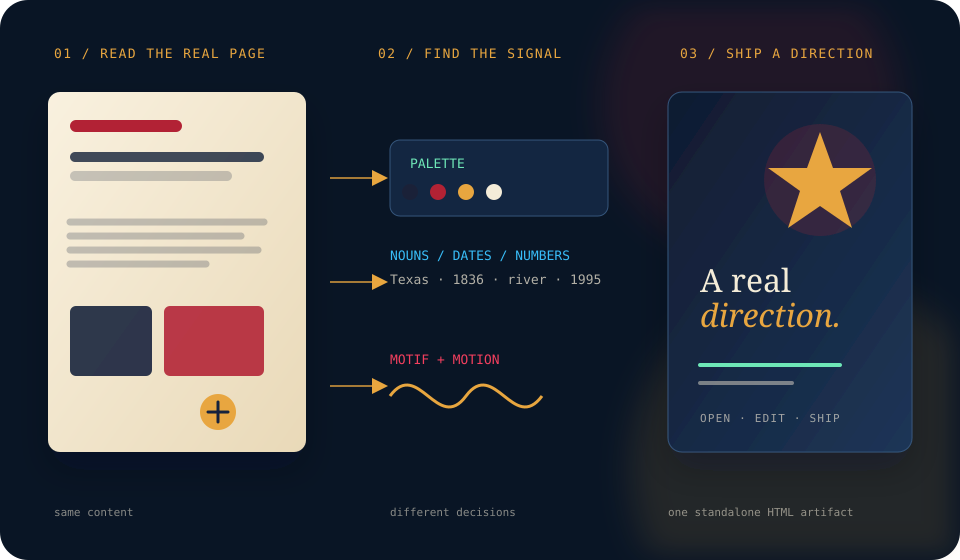

# reimagine-it

[](https://github.com/Kayforkind/reimagine-it/actions/workflows/audit.yml) [](CHANGELOG.md) [](LICENSE) [](https://skills.sh/kayforkind/reimagine-it)

# Make the page you already have worth keeping.

[](https://kayforkind.github.io/reimagine-it/#playground)

**reimagine-it** is Content-Derived Design for AI agents and the command line. Point it at an existing HTML page. It reads the real content, preserves the meaning, then gives the page a stronger visual system: typography, hierarchy, palette, composition, motif, and motion.

Not a template picker. Not a mood board. Not a prompt that fills your page with invented copy.

> **Your content narrows the design space. Your client approves the direction. A seed or lock makes the approved direction repeatable.**

<div align="center">

**[Open the live playground](https://kayforkind.github.io/reimagine-it/#playground)** · **[Browse the case studies](https://kayforkind.github.io/reimagine-it/)** · **[Install the skill](#install)**

</div>

---

## The workflow: beautify → compare → approve → repeat

A good redesign is not “generate once and hope.” Use a small, inspectable loop:

```text
source page
    ↓
extract content signals
    ↓
create a few distinct directions
    ↓
compare the actual page, not a fake prompt
    ↓
choose one direction
    ↓
pin its seed or lock its design DNA
    ↓
ship and audit
```

### Try it in three commands

```bash
# Generate a polished editorial webpage from an existing page
npx reimagine-it -i before.html -t webpage -o reimagined/page.html

# Generate a different medium from the same source
npx reimagine-it -i before.html -t infographic -o reimagined/poster.html

# Preview what the engine found before changing anything
npx reimagine-it -i before.html --dry
```

The input remains the source of truth. The engine extracts headings, paragraphs, list items, proper nouns, dates, numbers, emails, color words, and source hex values. It does not need a CDN, Figma file, paid API, or remote image service. Auto reports its decision instead of silently pretending a visual preference is objective.

---

## No accidental repetition

Fresh does not mean random chaos, and repeatable does not mean samey.

- **No seed:** a new creative direction each run. Layout density, anchor order, palette emphasis, and visual register can change.
- **`--seed 42`:** the same source and token reproduce the same direction for review, QA, and deployment. Auto also returns the selected seed in its report.
- **`lock`:** capture an approved design language — palette, type, motif, motion, and structure — then reuse it across pages or media. (The CLI core currently exposes seeded reuse; the agent skill handles lock files.)

```bash
# Explore distinct directions
npx reimagine-it -i page.html -t webpage -o draws/draw-a.html
npx reimagine-it -i page.html -t webpage -o draws/draw-b.html
npx reimagine-it -i page.html -t webpage -o draws/draw-c.html

# Approve one direction and make it reproducible
npx reimagine-it -i page.html -t webpage --seed 42 -o approved/page.html
```

For an AI agent:

```text
/reimagine-it webpage
/reimagine-it webpage --seed 42
/reimagine-it lock approved/page.html as house-style
/reimagine-it webpage --ref house-style
/reimagine-it slides --ref house-style
```

The goal is **controlled variation**: genuinely new when the client wants options, intentionally similar when the client wants a system.

---

## Ten usable output tokens

Every token generates a standalone HTML artifact with a distinct composition. The output is designed to be opened, reviewed, edited, and shipped — not just admired in a screenshot.

| Token | Best for | Output character |
|---|---|---|
| `webpage` | Editorial pages, articles, source documents | Measured reading layout, numbered sections, display/body contrast |
| `landing` | Product and service pages | Clear hero, CTA hierarchy, feature rhythm |
| `dashboard` | Metrics and operational content | Dark console, KPI cards, inline sparklines |
| `infographic` | Facts, comparisons, timelines | Common-scale bars, ISOTYPE units, lossless data table |
| `cinematic` | Narrative and brand moments | Full-viewport opening, depth, scroll-led sections |
| `artistic` | Posters and expressive pages | Oversized type, asymmetric rhythm, layered fields |
| `photography` | Portfolios and visual indexes | Folio composition, varied plate sizes, captions |
| `svg` | Marks, diagrams, living illustrations | Inline SVG, geometric motif, restrained micro-motion |
| `3js` | Spatial or object-based stories | Offline canvas object, drag-to-rotate interaction |
| `simulation` | Time, sequence, or process | Playable timeline with scrubber and speed control |

Force a token with the CLI:

```bash
npx reimagine-it -i source.html -t webpage
npx reimagine-it -i source.html -t landing
npx reimagine-it -i source.html -t infographic
npx reimagine-it -i source.html -t svg
npx reimagine-it -i source.html -t 3js
npx reimagine-it -i source.html -t simulation
```

List every token:

```bash
npx reimagine-it --list
```

## Design Auto — say what you want, then let it drive

When you do not want to choose a token, use `auto`. It reads the page, ranks the forms that fit its evidence, generates up to three candidate directions, verifies their safety and craft signals, and writes the strongest standalone result. The source is never overwritten.

```bash
npx reimagine-it --auto -i page.html -o reimagined/auto.html
npm run auto -- -i page.html -o reimagined/auto.html --report reimagined/auto.json
```

`auto` is intentionally model-agnostic. In a host agent, the model can provide the brief, inspect the candidate report, delegate visual review, and ask for approval; the deterministic engine still guarantees that the final artifact is source-backed, standalone, and reproducible when a seed is supplied.

---

## The client approval loop

Use the tool like a designer, not a slot machine:

1. **Start with the real page.** Do not rewrite the source into a generic prompt.
2. **Show two or three distinct draws.** Each should make a different, defensible choice — not just swap a hex value.
3. **Ask the client to choose a direction.** Prefer “editorial / cinematic / operational” over “do you like it?”
4. **Pin the approved direction.** Use `--seed` for one artifact or `lock` for a reusable system.
5. **Audit the output.** A beautiful page that clips text, loses focus visibility, or invents facts is not finished.
6. **Ship the artifact.** The generated HTML is standalone and can be opened locally or deployed as-is.

The design should be visibly different from the original while remaining recognizably about the same content. Meaning is preserved; hierarchy is transformed.

---

## Install

### AI agents — Agent Skills

```bash
npx skills add Kayforkind/reimagine-it
```

Works with hosts that support Agent Skills, including Cursor, Codex, Copilot, Gemini CLI, Windsurf, and others.

### Claude Code

```text
/plugin marketplace add Kayforkind/reimagine-it
/plugin install reimagine-it@reimagine-it
```

### Codex

```bash
codex plugin marketplace add Kayforkind/reimagine-it
codex plugin add reimagine-it@reimagine-it
```

### Factory Droid

```bash
droid plugin marketplace add https://github.com/Kayforkind/reimagine-it
droid plugin install reimagine-it@reimagine-it --scope user
```

Then ask the agent:

```text
/reimagine-it webpage
/reimagine-it infographic
/reimagine-it svg
/reimagine-it 3js
/reimagine-it simulation
```

---

## CLI — no agent required

### A safe handoff: stdout mode

Use `-o -` when another tool should receive only the generated HTML. Progress stays on stderr, so the result can be piped directly into a file, formatter, or deployment step.

```bash
cat page.html | npx reimagine-it -t webpage -o - > redesign.html
```

The CLI is zero-config for the core path and works with files or stdin:

```bash
# File in, file out
npx reimagine-it -i page.html -t webpage -o redesign.html

# Pipe HTML in
cat page.html | npx reimagine-it -t landing -o redesign.html

# Inspect extraction as JSON
npx reimagine-it -i page.html --json

# Preview extraction without generating
npx reimagine-it -i page.html --dry

# Reproduce an approved direction
npx reimagine-it -i page.html -t webpage --seed 42 -o approved.html
```

`--dry` shows the derived ground, accent, muted, surface, and ink colors, plus headings, list items, anchors, dates, numbers, and source hex values.

### CLI output guarantees

- Standalone HTML; no CDN required
- Source-derived palette and content anchors
- Seeded reproducibility when requested
- `prefers-reduced-motion`, `:focus-visible`, and `::selection` rules in every token
- No fabricated KPI values when source numbers exist
- Graceful empty-source handling

---

## DeepSeek Harness integration

The core package stays portable; `dsh/` contains an optional plugin adapter for [DeepSeek Harness](https://github.com/deepseek-ai/deepseek-harness). DeepSeek Harness is a developer-preview, plugin-first runtime where model providers, tools, sessions, sandboxes, storage, loops, and UI can be composed independently. That makes it a strong host for Auto without coupling this project to its rapidly changing runtime.

```bash
dsh plugin --profile web add reimagine-it
dsh web
```

After installation, the `design_auto` tool reads a workspace-relative HTML file, chooses a direction, generates and verifies candidates, and returns the best artifact. It never edits the source. DSH owns model access, context, approvals, sandboxing, persistence, and traceability; reimagine-it owns the design decision and HTML artifact. Read the [DeepSeek Harness adapter guide](dsh/README.md) for the exact contract and safety boundary.

## MCP server

Expose the method to any MCP-compatible agent:

```json
{
  "mcpServers": {
    "reimagine-it": {
      "command": "npx",
      "args": ["reimagine-it-mcp"]
    }
  }
}
```

The server exposes five tools:

- `reimagine` — generate a token-specific redesign from raw HTML
- `design_auto` — choose, generate, verify, and explain the strongest direction
- `extract_content` — inspect the source signals
- `list_tokens` — discover available output directions
- `audit_html` — run the craft-floor audit

The core CLI remains usable without the MCP SDK. The MCP server shares the same token registry as the CLI, so token names and descriptions do not drift between interfaces.

---

## Browser extension

The `extension/` directory contains a Manifest V3 extension for Chrome, Edge, and Firefox. It now exposes the same ten output directions as the CLI, including the interactive `3js` and `simulation` forms.

1. Open `chrome://extensions` or `edge://extensions`.
2. Enable **Developer mode**.
3. Choose **Load unpacked**.
4. Select this repository's `extension/` directory.
5. Open a page, click **Reimagine This Page**, choose a token, and compare the result.

The extension extracts content in the browser and opens a local generated artifact. No server, API key, or page upload is required.

→ [Extension installation and limitations](extension/README.md)

---

## What makes this different

Most design prompts begin with a visual adjective: *modern*, *premium*, *minimal*, *bold*. That is how unrelated pages end up looking alike.

Content-Derived Design starts somewhere more useful:

```text
source signals → design decisions → working artifact → human approval
```

A lighthouse essay can become a beam-led editorial page. A SaaS observability page can become a pulse-led operational console. A restaurant menu can become a warm, typographic folio. The source constrains the design so the result has a reason to exist.

The engine also refuses the usual shortcuts:

- no invented testimonials or logos;
- no placeholder copy painted into empty plates;
- no generic “AI startup” dashboard for every source;
- no CDN dependency for the generated artifact;
- no accidental duplication when a new direction is requested.

---

## Proof, not promises

The repository contains curated source/after pairs and regenerators. They are reference artifacts; the CLI is the path for transforming your own page:

| Source | What it demonstrates | Proof |
|---|---|---|
| Texas notebook | Content-derived palette, place anchors, editorial and spatial directions | [`gold/webpage/`](gold/webpage/) |
| Pulsewave | SaaS content becoming pulse/trace-oriented design | [`gold/pulsewave/`](gold/pulsewave/) |
| Two Lights | Personal essay becoming a lighthouse-led narrative system | [`gold/twolights/`](gold/twolights/) |
| Saffron & Smoke | Menu content becoming food-specific visual language | [`gold/saffron/`](gold/saffron/) |
| Jules Ice Cream | A second source with parlor-specific design DNA | [`gold/jules/`](gold/jules/) |
| Five non-web artifacts | CLI, protocol, data ledger, and code-architecture transformations | [`gold/five/`](gold/five/) |

See the [full showcase](docs/SHOWCASE.md) or open the [live gallery](https://kayforkind.github.io/reimagine-it/).

The repository's static gold pages are curated reference artifacts. The standalone CLI is the general-purpose path for beautifying a user's own HTML. GIFs remain optional social-proof assets; the primary proof is the live, inspectable HTML output and its audit report.

---

## Quality bar

Run the same checks locally and in CI:

```bash
npm test
npm run audit
npm run test:unit
```

Current automated coverage:

- 43 CLI and Auto unit tests
- 32 curated gold HTML files audited
- 50 end-to-end generated outputs tested across five sources and ten tokens (the repository validation sweep)
- deterministic seeded output checks
- intentional-failure regression fixture to ensure CI catches craft-floor failures
- plugin manifest consistency verification

The audit checks typography, palette, motion, content, structure, and performance heuristics. A warning is advisory; a failure blocks shipping.

---

## Contributing

The best contribution is a real source with a defensible redesign, not another abstract prompt.

- Add a domain, form, modifier, or lock with its source content.
- Explain why the palette, motif, type, and motion come from that source.
- Provide a regenerator for every committed visual.
- Include an offline artifact and run `npm test`.

See [`CONTRIBUTING.md`](CONTRIBUTING.md), [`ROADMAP.md`](ROADMAP.md), and [`CHANGELOG.md`](CHANGELOG.md).

---

## License

MIT — see [`LICENSE`](LICENSE).
