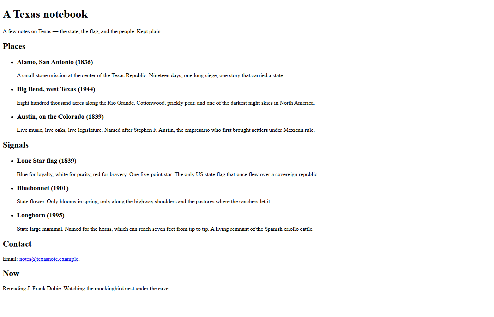
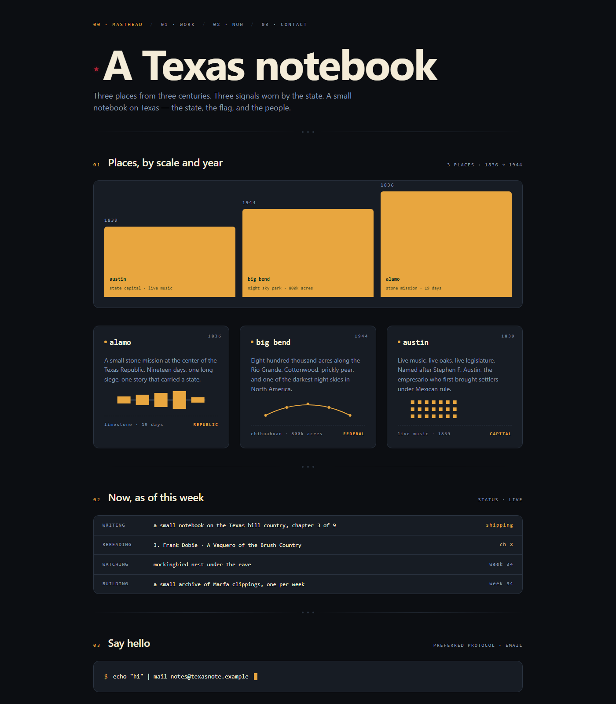
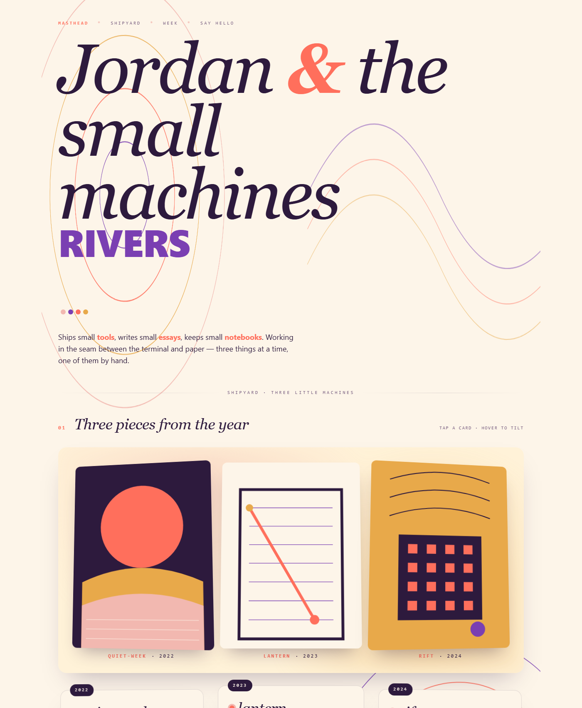
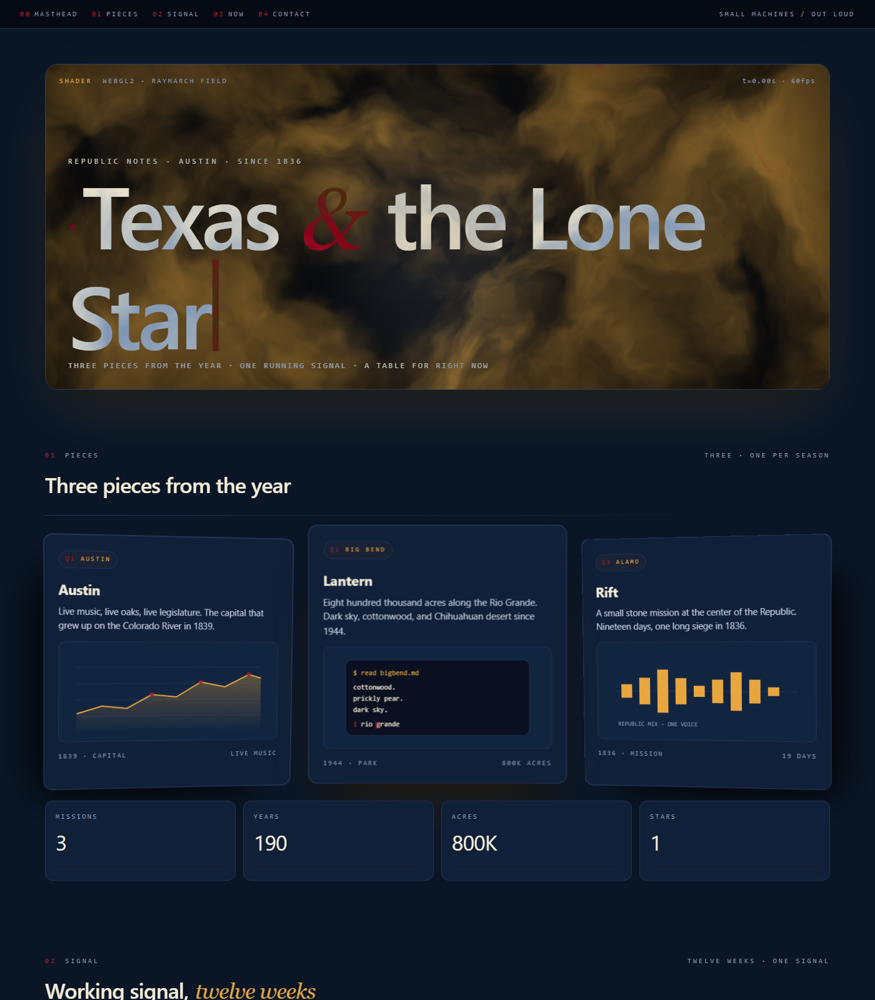
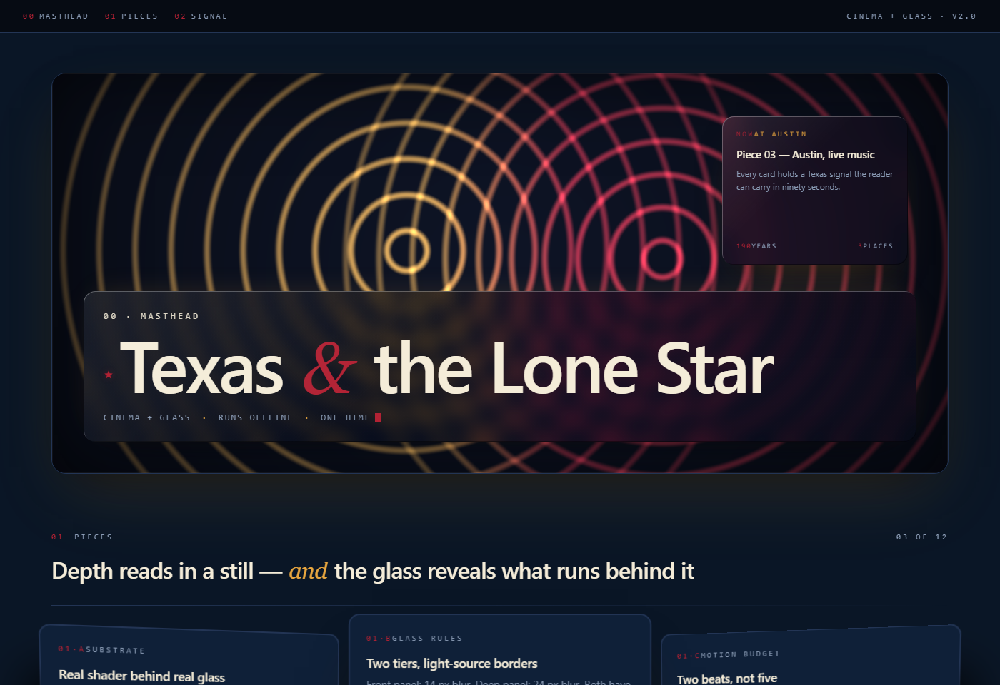
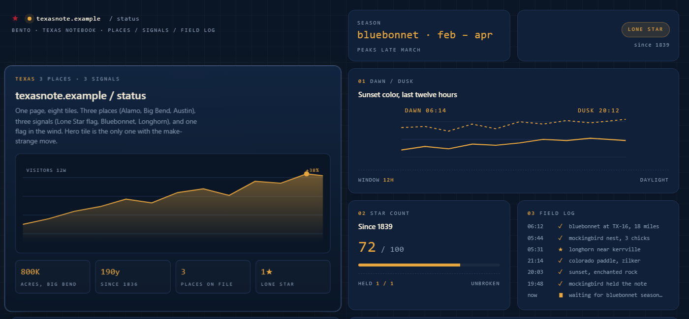

# reimagine-it

[](LICENSE) [](https://code.claude.com/docs/en/plugins) [](https://cursor.com) [](https://github.com/openai/codex) [](https://agentskills.io/specification) [](skills/reimagine-it/SKILL.md) [](https://github.com/sponsors/Kayforkind)

**Your AI redesigns the file you actually have — from what it is about.**

Ask for a redesign and most agents ship a mood board. `/reimagine-it` reads the nouns, dates, and colors in *your* source and ships a real artifact: webpage, infographic poster, SVG, Three.js scene, simulation, PDF, or slides. One file. Offline. No Figma, no CDN.

```bash
npx skills add Kayforkind/reimagine-it
```

Then: `/reimagine-it` · `/reimagine-it infographic` · `/reimagine-it svg` · `/reimagine-it 3js` · `/reimagine-it simulation`

Live gold: [kayforkind.github.io/reimagine-it](https://kayforkind.github.io/reimagine-it/) · index: [`gold/README.md`](gold/)

```
/reimagine-it webpage
/reimagine-it webpage artistic | dashboard | photography | cinematic | landing
/reimagine-it infographic
/reimagine-it svg | 3js | simulation
```

### Source 1 — Texas notebook

Palette and motifs come from *this* file (Lone Star flag, Alamo, Rio Grande). The SVG weenie is the **actual flag**: white star, white over red — not a gold-star logo.


Alive-micro close-ups (weenie breathe is the Lone Star flag):


Live loops (GitHub file view is source only): open [`gold/forms/see.html`](gold/forms/see.html) locally via `python -m http.server` in `gold/forms/`.


### Source 2 — Jules Ice Cream

Same tokens, parlor DNA. Not a Texas notebook with scoops glued on. [`gold/jules/`](gold/jules/)


---

## The source page (before)

Every "after" in the gallery starts from this exact naive HTML &mdash; one heading, two lists, an email, a note. **The design language you see on the right side of every comparison was chosen because the content mentions Texas, the Lone Star flag, Alamo, Rio Grande, and Bluebonnet.**

```html
<h1>A Texas notebook</h1>
<p>A few notes on Texas &mdash; the state, the flag, and the people.</p>

<h2>Places</h2>
<ul>
  <li><h3>Alamo, San Antonio (1836)</h3><p>A small stone mission at the center of the Texas Republic&hellip;</p></li>
  <li><h3>Big Bend, west Texas (1944)</h3><p>Eight hundred thousand acres along the Rio Grande&hellip;</p></li>
  <li><h3>Austin, on the Colorado (1839)</h3><p>Live music, live oaks, live legislature&hellip;</p></li>
</ul>

<h2>Signals</h2>
<ul>
  <li><h3>Lone Star flag (1839)</h3></li>
  <li><h3>Bluebonnet (1901)</h3></li>
  <li><h3>Longhorn (1995)</h3></li>
</ul>
```

Change the source and the whole design changes. `/reimagine-it` on a coffee roaster's site pulls warm browns and burlap textures; on a night-diving report it pulls deep teals and bioluminescent accents; on a printing press's page it pulls hand-set caps and paper grain. The gallery below is one point on that surface.

---

## Same command, run three times &mdash; the creative engine is wide open

Run `/reimagine-it webpage` on the same source three times and you get **three visibly different reader registers** &mdash; not the same page reprinted. In v2.2 the engine samples along **seven axes**: **reader register**, **ground / palette weighting**, **hero move**, **plate style**, **motion budget**, **type accent**, **3D signature**. The content narrows the sub-space (a Texas notebook can't legitimately return a marine-caustics shader), but *inside* that sub-space the engine draws fresh every time.


- **Draw A** &mdash; `dashboard-live` register &middot; navy ground &middot; KPI skyline chart of the three places &middot; dashboard tiles &middot; counter-rise motion &middot; sans + mono &middot; lifted-card 3D. See [`gold/webpage/after.html`](gold/webpage/after.html).
- **Draw B** &mdash; `field-guide-quiet` register &middot; parchment ground &middot; hand-drawn Texas map with pin markers + compass rose &middot; numbered letterpress plates with red drop caps &middot; bluebonnet-drift &middot; italic serif &middot; inset-shadow deboss. See [`gold/webpage/after-2.html`](gold/webpage/after-2.html).
- **Draw C** &mdash; `cinematic-shader` register &middot; **full-bleed WebGL2 west-Texas sunset** (dusk navy &rarr; horizon orange &rarr; ember, twinkling star field, ridge silhouette) &middot; bento plates over the deep ground &middot; scroll-driven plate rise + kinetic wordmark bloom + click-to-spin Lone Star &middot; serif display + mono trim &middot; matcap plate highlights. Ships the full **v2.2 craft floor**: reduced-motion decompose, `:focus-visible` gold ring, compositor-only motion, no `transition: all`. See [`gold/webpage/after-3.html`](gold/webpage/after-3.html).

All three are correct outputs of the exact same command on the exact same source. They share the content-derived palette family (navy / cream / red / gold) and the lone-star motif &mdash; both derived from the source &mdash; but they pick different *reader registers*, palette anchors, hero moves, and motion budgets.

**Reproducibility when you need it.** `--seed <n>` pins the sample so a specific draw is byte-equivalent across runs. `--variant a` / `--variant b` / `--variant c` are named seeds &mdash; `a` reproduces Draw A, `b` reproduces Draw B, `c` reproduces Draw C. The pack ships extra letters as they land. Everything else runs fresh by default.

```
/reimagine-it webpage                              # fresh sample every time
/reimagine-it webpage --variant a                  # Draw A (dashboard-live)
/reimagine-it webpage --variant b                  # Draw B (field-guide-quiet)
/reimagine-it webpage --variant c                  # Draw C (cinematic-shader)
/reimagine-it webpage --variant editorial-drift    # any named reader register
/reimagine-it webpage --seed 42                    # pin an arbitrary sample
```

Regenerate the quartet locally: `python gold/compare.py` (writes `gold/webpage/quartet.png` and `twins.png` alongside every per-pack compare).

---

## Install

One chair: `skills/reimagine-it/`. Hosts with a plugin marketplace get a native wrapper in this repo. Hosts that only speak Agent Skills install the same folder.

**Claude Code**

```text
/plugin marketplace add Kayforkind/reimagine-it
/plugin install reimagine-it@reimagine-it
```

Then enable updates once: `/plugin` → **Marketplaces** → **reimagine-it** → **Enable auto-update**. Claude Code leaves third-party auto-update off by default. Run `/reload-plugins` when prompted.

**Codex**

```bash
codex plugin marketplace add Kayforkind/reimagine-it
codex plugin add reimagine-it@reimagine-it
```

Codex refreshes Git marketplaces at startup. To fetch immediately: `codex plugin marketplace upgrade reimagine-it`, then start a new session.

**Factory Droid**

```bash
droid plugin marketplace add https://github.com/Kayforkind/reimagine-it
droid plugin install reimagine-it@reimagine-it --scope user
```

Droid tracks Git plugins by commit. After a merge: `droid plugin marketplace update reimagine-it`, then `droid plugin update reimagine-it@reimagine-it --scope user`.

**Cursor, Copilot, Gemini CLI, Windsurf, and other Agent Skills hosts**

These hosts have no third-party plugin marketplace for this kind of chair. They load `SKILL.md`.

```bash
npx skills add Kayforkind/reimagine-it             # one project
npx skills add Kayforkind/reimagine-it -g           # global
gh skill install Kayforkind/reimagine-it reimagine-it --agent cursor
gemini skills install https://github.com/Kayforkind/reimagine-it.git --path skills/reimagine-it
```

**Pi**

```bash
pi install https://github.com/Kayforkind/reimagine-it
```

Then `/reload` in an open Pi session.

Then say `/reimagine-it` in the host. Also matches: "reimagine it", "redesign this page", "make an infographic".

---

## The five levers

| Lever | Syntax | Effect |
|-------|--------|--------|
| **Form** | `webpage` \| `svg` \| `3js` \| `simulation` \| `pdf` \| `slides` \| `document` \| `mobi` \| `epub` \| `code` \| `cli` \| `protocol` \| ... | Force the medium. `svg` and `3js` are **alive by default** (2–4 fact-tied micro-loops). Leftover `still` / `no-motion` / `print` freezes them. |
| **Domain** | `webpage artistic` \| `dashboard` \| `photography` \| `cinematic` \| `landing` \| `portfolio` \| `infographic` | Force the aesthetic. `infographic` is a statistical poster (common-scale encodings + ISOTYPE + data table), not an ops dashboard. See [`references/domains/`](skills/reimagine-it/references/domains/). |
| **Modifier** | `webpage cinematic glassmorphism` \| `bento` \| `neon` \| `brutalism` \| `neumorphism` \| `handdrawn` | Layer a UI/UX style on any domain. See [`references/modifiers/`](skills/reimagine-it/references/modifiers/). |
| **Font** | `--font "Playfair Display, Iowan Old Style, Georgia, serif"` | Pin display / body family. Full stack. No webfont fetch unless `--allow-fetch`. |
| **Lock** | `lock <path> as <name>` then `--ref <name>` | Capture design DNA (palette, type, motifs, motion, 3D) and reuse it &mdash; even across media. |

Compose freely: `/reimagine-it webpage artistic glassmorphism --font "Playfair Display, serif" --ref house-cinema`.

---

## Three hard guarantees (v2.2)

Three things that were sometimes missing before are now part of the shipped bar. If any fails, the command reports `partial`, not `shipped`.

- **Same-format twin by default.** If you point at a distributable file (`.pdf`, `.docx`, `.pptx`, `.mobi`, `.azw3`, `.epub`, `.md`), the default output is **two artifacts**: a companion HTML reading room *and* a same-format twin in the source's native format. The HTML alone is not enough &mdash; you picked that format because you want to hand it around in that format. If the same-format toolchain is missing on the current machine (e.g. no Calibre for `.mobi`), the report names the missing tool and the exact next command that would produce the twin; it does not silently drop the twin.
- **Visual verification pass on every render.** Before reporting `shipped`, the skill renders the hero into an image and manually scans it for: blank plates, placeholder labels (`blank` / `TBD` / `lorem` / `Title goes here`), clipped or overlapping text (e.g. `POST OFFICE` rendered as `POST O CE` because a foreground shape covers the label), broken SVGs, off-palette accents, fabricated content, dead motion (identical frame hashes), and &mdash; new in v2.2 &mdash; **every plate maps to a source anchor** (no unmapped plates painted). Any failure fails the render and forces a fix or a `partial` report &mdash; **empty slots are deleted, never painted with a placeholder**.
- **Craft floor on every webpage output (new in v2.2).** Every rendered page must clear the craft floor before shipping: `:focus-visible` ring with contrast &ge; 3:1, `::selection` on-palette, motion timing 100&ndash;300 ms `ease-out` for micro-interactions, animations only on `transform` and `opacity` (compositor-only), `prefers-reduced-motion` respected by *decomposing* (turn off scroll-triggered motion, cap kinetic type at the lit state, disable WebGL loops &mdash; not by suppressing focus rings), no `transition: all`, no `outline: 0` without an explicit replacement, scroll-driven animations offloaded via `animation-timeline: view()` when supported, and Core Web Vitals sane (no CLS from motion, INP under 200 ms). See [`references/craft-floor.md`](skills/reimagine-it/references/craft-floor.md).

All three are enforced by [`skills/reimagine-it/SKILL.md`](skills/reimagine-it/SKILL.md) &sect; 2.6 / &sect; 5.b / &sect; 5.c and by [`references/forms/universal.md`](skills/reimagine-it/references/forms/universal.md). The research that raised the bar (150+ sources: award-winning studios, editorial newsrooms, motion masters, WebGL creative devs, type foundries, scrollytelling, print-to-web bridges, sonic branding, modern web-platform features) lives at [`references/research/web-craft-2025.md`](skills/reimagine-it/references/research/web-craft-2025.md).

---

## Case studies &mdash; one source, one command each

Every case below reimagines the **exact same naive HTML** ([`gold/webpage/before.html`](gold/webpage/before.html) &mdash; a plain Texas notebook, 40 lines, no CSS, one email) with **one different token**. Cases 1&ndash;8 are eight different domains and modifiers on the default `webpage` pack. **Case 09** is the v2.2 raised bar &mdash; a third *reader register* of the default pack (`--variant c`, `cinematic-shader`). **Case 10** is the v2.3 infographic pack &mdash; the same notebook read as a statistical poster, not a dashboard. **Cases 11&ndash;13** keep that HTML and change the *form*: SVG, Three.js, simulation. To match how a designer reads a case study, each case is laid out top-to-bottom:

1. the **before** shot sits on its own line,
2. the **four notes the command picked** (palette &middot; motif &middot; motion &middot; 3D) sit between the two shots as real descriptive text,
3. the **after** shot sits on its own line.

Every image renders locally from a real `.html` file in this repo. Regenerate the whole set: `python gold/shots.py`.

---

### Case 01 &middot; Default spine

`/reimagine-it webpage`

*A small notebook OS for a small notebook on Texas.*

**Before.** The raw HTML in the browser default &mdash; one heading, two lists, an email, a note. Times New Roman on paper white. No hierarchy, no motion, no motif.



**The four notes the command picked.**

- **Palette** &mdash; deep-night navy ground, cream text, sun-gold accent, star-red reserved for the drop caret and one hover state. Chosen because the source names the **Lone Star flag** (navy / white / red) and **Big Bend** (gold sunset).
- **Motif** &mdash; a small red star before the H1; three sun-gold KPI tiles pulling real numbers from the source (`3 places`, `1836 &rarr; 1944`); three place cards with a mini-bar chart, a sparkline, and a rug-plot; a terminal card carrying the source's email.
- **Motion** &mdash; counters rise on load, the caret blinks in the terminal card, nothing else moves.
- **3D** &mdash; cards lift ~8 px with a soft cast shadow. No rotation, no parallax.

**After.**



Open the live file &rarr; [`gold/webpage/after.html`](gold/webpage/after.html)

---

### Case 02 &middot; `artistic`

`/reimagine-it webpage artistic`

*The notebook as an editorial cover.*

**Before.** Same raw Texas notebook.


**The four notes the command picked.**

- **Palette** &mdash; cream ground with navy display type; the ampersand and one word (`REPUBLIC`) set in star-red; sun-gold reserved for the concentric orbital arcs behind the type.
- **Motif** &mdash; `Texas & the Lone Star REPUBLIC` set at hero scale in italic serif; three drifting SVG orbits read as sunset rays over the prairie; a mini pin marks Austin on the orbit.
- **Motion** &mdash; the italic ampersand sways &plusmn;3&deg; on a 4-second cycle (with `transform-origin` locked so it pivots from its baseline); the orbital arcs drift slowly.
- **3D** &mdash; the three place-cards fan out at real &plusmn;16&deg; with a 40 px drop-shadow. The 3D reads in a still.

**After.**



Open the live file &rarr; [`gold/domains/artistic/after.html`](gold/domains/artistic/after.html)

---

### Case 03 &middot; `dashboard`

`/reimagine-it webpage dashboard`

*The notebook as an ops surface.*

**Before.** Same raw Texas notebook.


**The four notes the command picked.**

- **Palette** &mdash; navy ground with a subtle gold-hatched paper texture; sun-gold and emerald traffic pills for the two places doing work; star-red reserved for the alert dot and the drop caret.
- **Motif** &mdash; top ribbon of four sun-gold KPI tiles pulled from the source (`3 projects`, `11k lines`, `p214 reading`, `3/9 book chapter`); a two-color shipping-volume chart with a projection line; three status rows for `alamo` / `big bend` / `austin`; a `Now, this week` table; a terminal card sending the source's email.
- **Motion** &mdash; the chart bars rise into place between frames (proven in the motion strip lower on this page); counters count up; the caret blinks in the terminal card.
- **3D** &mdash; cards lift ~10 px; KPI tiles sit on their own soft-shadowed row; no rotation, no parallax.

**After.**


Open the live file &rarr; [`gold/domains/dashboard/after.html`](gold/domains/dashboard/after.html)

---

### Case 04 &middot; `photography`

`/reimagine-it webpage photography`

*The notebook as a numbered folio.*

**Before.** Same raw Texas notebook.


**The four notes the command picked.**

- **Palette** &mdash; cream ground with warm dust and near-black type; sun-gold caption tags; star-red drop-caps and the small folio star at top-left.
- **Motif** &mdash; Didot-scale italic-then-caps nameplate reading `Texas / NOTES`; a four-plate index bar (`Plate I &middot; Austin`, `Plate II &middot; Big Bend`, `Plate III &middot; Alamo`, `Colophon`); three real SVG "photographs" drawn on the page (Austin sunset with a moon disc, Big Bend night sky, Alamo mission silhouette); dropcap paragraphs; per-plate caption strips (`Medium &middot; Weight &middot; State`).
- **Motion** &mdash; deliberately quiet. A folio doesn't twitch.
- **3D** &mdash; none. The whole thing sits flat like a printed spread.

**After.**


Open the live file &rarr; [`gold/domains/photography/after.html`](gold/domains/photography/after.html)

---

### Case 05 &middot; `cinematic`

`/reimagine-it webpage cinematic`

*The notebook as a shader-lit oversized headline.*

**Before.** Same raw Texas notebook.


**The four notes the command picked.**

- **Palette** &mdash; deep-night navy ground; the shader runs **navy &rarr; sun-gold &rarr; star-red** in a raymarched interference field, chosen because the source names the **Lone Star** and **Big Bend's sunset**. A marine-biology source would render a teal-and-current shader instead.
- **Motif** &mdash; an inline `<canvas>` + inline fragment shader (`<script type="x-shader/x-fragment">`) carrying an oversized `Texas & the Lone Star` set in ivory with a red ampersand; three place-cards for Austin / Big Bend / Alamo; four sun-gold KPI stats (`3 missions`, `190 years`, `800K acres`, `1 star`).
- **Motion** &mdash; the shader field evolves visibly frame to frame (proven in the motion strip below); the KPI counters rise on load.
- **3D** &mdash; the three place-cards sit forward with a mild `translateZ(20px)` and a paired soft/dark shadow. The shader plate has a 24 px inset shadow.

**After.**



**No CDN, no `import` from `https://`, no vendor folder.** The shader ships in the same `.html` file as everything else.

Open the live file &rarr; [`gold/domains/cinematic/after.html`](gold/domains/cinematic/after.html)

---

### Case 06 &middot; `cinematic` + `glassmorphism`

`/reimagine-it webpage cinematic glassmorphism`

*Two glass tiers over the running sunset &mdash; glass reveals, glass never covers.*

**Before.** Same raw Texas notebook.


**The four notes the command picked.**

- **Palette** &mdash; the same navy / gold / red sunset shader keeps running behind the glass; the glass itself picks up its color from what it's blurring, so the front tier reads red-warm and the deep tier reads gold-warm on the same page.
- **Motif** &mdash; a **front tier** (14 px blur) over the masthead carrying `Texas & the Lone Star`; a **deep tier** (24 px blur) over a `Piece 03 &mdash; Austin, live music` data tile; three small `SUBSTRATE / GLASS RULES / MOTION BUDGET` reader cards below carrying the rules of the pack itself.
- **Motion** &mdash; the substrate runs, the glass itself never tilts or blurs on hover &mdash; glass is a surface, not an object. Two beats per section, not five.
- **3D** &mdash; light-source-consistent borders (bright top-left inset, dark bottom-right inset) with colored `box-shadow`s. Blur **reveals** the running sunset; it never covers a solid color.

**After.**



Open the live file &rarr; [`gold/modifiers/cinematic-glassmorphism/after.html`](gold/modifiers/cinematic-glassmorphism/after.html)

---

### Case 07 &middot; `dashboard` + `bento`

`/reimagine-it webpage dashboard bento`

*Nine tiles, unequal sizes, one elevated hero.*

**Before.** Same raw Texas notebook.


**The four notes the command picked.**

- **Palette** &mdash; navy ground with sun-gold accents; emerald and star-red used sparingly for status; the hero tile lifts brighter than its neighbors so the elevation reads before the content does.
- **Motif** &mdash; a named-cell CSS Grid with `grid-template-areas: "brand brand hours state" / "hero hero chart chart" / "hero hero latency logs" / "stack stack incidents incidents"`. Nine tiles, unequal but with shared chrome, each holding one bit of the source (places / signals / season / chart / field log / notes).
- **Motion** &mdash; the hero visitors chart ticks in; the field-log rows fade in one per second; the `waiting for bluebonnet season` row pulses.
- **3D** &mdash; the hero tile is visibly elevated (`translateZ(24px)` + a 40 px shadow). Every other tile sits flat but casts a small shadow so the elevation reads.

**After.**



Open the live file &rarr; [`gold/modifiers/dashboard-bento/after.html`](gold/modifiers/dashboard-bento/after.html)

---

### Case 08 &middot; `landing` + `neon`

`/reimagine-it webpage landing neon`

*Void ground, one accent, one word doing every emotional job.*

**Before.** Same raw Texas notebook.


**The four notes the command picked.**

- **Palette** &mdash; near-black void ground with a single radial-gradient vignette; **one** high-chroma accent (`#e8a63f` &mdash; sun gold) doing every emotional job: the italic word, the orbital, the CTA border, the blinking cursor. Gold picked because the source names the **Lone Star**.
- **Motif** &mdash; an oversized ivory headline `Ship the note, not the pitch.` with the italic `note` set in glowing gold; an orbital SVG with a single gold star at its center; one CTA (`SEE THE NOTEBOOK &rarr;`); a status pill (`OPEN &middot; ACCEPTING WORK`); four bottom stats (`3 places on file`, `1 flag in the wind`, `1836 republic since`, `1 lone star`).
- **Motion** &mdash; the `note` word pulses letter-spacing on a 4-second cycle; the orbital draws itself on load; a small square cursor blinks after the email.
- **3D** &mdash; none. All the depth comes from the glow (double `drop-shadow`) and the vignette. Neon reads flat on purpose.

**After.**


Open the live file &rarr; [`gold/modifiers/landing-neon/after.html`](gold/modifiers/landing-neon/after.html)

---

### Case 09 &middot; `webpage --variant c` (v2.2 raised bar, `cinematic-shader` register)

`/reimagine-it webpage --variant c`

*The notebook as a cinematic reading room &mdash; the sky in the source becomes the sky in the browser.*

**Before.** Same raw Texas notebook.


**The five notes the command picked** (Draw C runs an extra note &mdash; the *reader register* &mdash; from v2.2 forward).

- **Reader register** &mdash; `cinematic-shader`. Chosen because the source describes **west Texas at low sun** ("Big Bend, the darkest night skies in North America", "Rio Grande sunset", "Lone Star" in the flag). A dashboard register would have been correct too; this run drew the cinematic card.
- **Palette** &mdash; **dusk navy &rarr; horizon orange &rarr; ember &rarr; earth rust &rarr; cream ink &rarr; sun-gold accent**. Every color is a west-Texas-sunset color pulled straight from the source's own imagery.
- **Motif** &mdash; a full-bleed **WebGL2 fragment shader** paints the sky: vertical dusk-to-ember bands, a slow horizon glow that drifts, a warm sun disc off-center, a hash-noise star field above the dusk line, and a low three-peak ridge silhouette. The shader ships inline in the same `.html` file (no CDN, no vendor). A CSS gradient fallback in the same content-derived palette runs when WebGL is unavailable. Above the sky sits a **stroke-then-fill kinetic serif TEXAS wordmark** with a soft orange glow, an italic serif subhead with amber highlights on the source's own three anchor words (*state*, *flag*, *people*), and six content-derived plates (Alamo, Big Bend, Austin, Lone Star, Bluebonnet, Longhorn) with hand-drawn SVG motifs.
- **Motion** &mdash; the sunset **evolves visibly** (horizon glow drift, twinkling stars, sun-disc micro-drift); the TEXAS wordmark **fill-in** and **glow-in** on load (compositor-only: `opacity` + `transform`); the six plates **rise into view** on scroll via `animation-timeline: view()`; clicking the Lone Star **spins it 360&deg;** as a hidden Cartier-style reward.
- **3D** &mdash; the plates lift on hover (`translateY(-4px)`) with a soft-shadow plate treatment, and the plate motifs sit forward on their own `translateZ(20px)` layer inside a `perspective: 800px` parent.

**Craft floor** (v2.2, all shipped in this file).

- `:focus-visible` &mdash; every link, button, and interactive SVG shows a **2 px sun-gold outline with 3 px offset**, contrast &ge; 3:1 against the ground.
- `::selection` &mdash; on-palette gold-on-earth so highlighted text matches the design.
- `prefers-reduced-motion: reduce` &mdash; **decomposes** correctly: the WebGL loop stops, kinetic type pins to the lit end-state (still legible), scroll-driven plate rise is disabled, `:focus-visible` still animates in but its transition is instant. Focus indicators are **never** hidden.
- **Compositor-only motion** &mdash; every animation touches only `transform` and `opacity`. No `width`, `height`, `top`, `left`, `filter` in transitions. No `transition: all`.
- **Scroll-driven** &mdash; the plate reveal uses `animation-timeline: view()` where supported so scroll motion runs off the main thread.
- **Type space reserved** &mdash; the kinetic wordmark reserves its final space before it animates, so no layout shift (CLS = 0).

**After.**


**No CDN, no `import` from `https://`, no vendor folder, no external font fetch.** The WebGL2 shader source, the SVG motifs, and every micro-interaction ship in the same `.html` file. One artifact.

Open the live file &rarr; [`gold/webpage/after-3.html`](gold/webpage/after-3.html)

---

### Case 10 &middot; `infographic` (v2.3, statistical poster)

`/reimagine-it infographic`

*The notebook as a paper poster of an argument &mdash; one question, answered in marks you can read in a still. Not a dashboard. This gold is **one draw of this Texas source**. A different file (or leftover words after the token) must change palette, pattern, glyphs, and layout. Leftover words are an open brief, not a closed list of themes.*

**Before.** Same raw Texas notebook.


**The four notes the command picked.**

- **Palette** &mdash; parchment ground (`#f4ecd8`) with navy ink, star-red, and sun gold. Same Lone-Star family as every other Texas draw; weighted as *paper*, not night ops.
- **Motif** &mdash; a **Priestley timeline 1836&ndash;1995** on a common year scale (Alamo, Austin + flag sharing 1839, Bluebonnet, Big Bend, Longhorn). An **ISOTYPE strip** of eight equal cottonwood-and-ridge units for Big Bend's 800,000 acres (Neurath: more copies, never a bigger icon). Custom glyphs for mission, ridge, capitol, star, bloom, horns. A schematic Texas with three pins. A **lossless data table** of the six named facts.
- **Motion** &mdash; Lone Star pulse, bluebonnet sway, longhorn horn-tip opacity. Compositor-only (`transform` / `opacity`). The encodings are true at frame 0 so a PNG is enough.
- **3D** &mdash; the poster is **flat** (no `rotateX`). Depth is a paper drop-shadow only, so the timeline stays a true common scale. Bars are not extruded (lie factor).

**Craft floor** (v2.3, all shipped in this file).

- `:focus-visible` &mdash; 2 px star-red outline, 3 px offset, on links.
- `::selection` &mdash; gold on navy ink.
- `prefers-reduced-motion: reduce` &mdash; decomposes: animations pin to the final state; focus rings stay.
- **Compositor-only motion** &mdash; no `transition: all`. No layout properties animated.
- **No fabricated numbers.** Every year and magnitude is in the source. 19-day siege is a label, not a bar on the century axis.

**After.**


Open the live file &rarr; [`gold/domains/infographic/after.html`](gold/domains/infographic/after.html)

---

## Same HTML. SVG, Three.js, a simulation.

The webpage gallery is one family. The same `gold/webpage/before.html` also ships as a vector weenie, a 3D field, and a playable year-clock. That is the leap most agents skip: they restyle the page. `/reimagine-it` can change the *medium*.

**Before.** Same raw Texas notebook.


### Case 11 &middot; `svg`

`/reimagine-it svg`

*The notebook as one mark you can drop in a README — alive by default (micro-motion, not a paper poster).*

- **Palette** &mdash; parchment, navy, star-red, sun gold (from the flag and the land in the source).
- **Motif** &mdash; Lone Star **flag** (canton + bars + star), schematic Texas with unlabeled pins, legend gutter, Priestley 1836&ndash;1995 (1839 is a gold tick), eight equal acre units.
- **Motion** &mdash; alive-micro: star breathe, Rio Grande dash flow, Alamo pin ping, 1839 tick hush. Hover a pin and its legend swatch answers. Brief `still` freezes loops. `prefers-reduced-motion` keeps hover, kills loops.
- **Not** &mdash; Mermaid. Not labels sitting on the map. Not a PNG renamed `.svg`. Not every mark bouncing.


Open the live file &rarr; [`gold/forms/svg/after.svg`](gold/forms/svg/after.svg) · loop close-ups &rarr; [`gold/forms/see.html`](gold/forms/see.html)

### Case 12 &middot; `3js`

`/reimagine-it 3js`

*The three places as a room you can orbit under a west-Texas sunset. Offline Three.js r185, vendored, no CDN. Alive by default.*

- **Palette** &mdash; dusk navy sky, earth ground, cream mission, gold star and river.
- **Motif** &mdash; Alamo chapel facade, capitol wings + dome, Big Bend ridge with a gold Rio Grande tube, upright star monument.
- **Motion** &mdash; alive-micro: star turn, gold motes on the river, chapel-window sun-breath, slow wide-drift on “All three”. Orbit drag and HUD look-ats in the **footer strip**. Brief `still` pins the camera. Reduced motion stops idle life.
- **Not** &mdash; a default cube. Not four cones. Not type stacked on the canvas.


Open the live file &rarr; [`gold/forms/3js/after.html`](gold/forms/3js/after.html) · same gallery &rarr; [`gold/forms/see.html`](gold/forms/see.html)

### Case 13 &middot; `simulation`

`/reimagine-it simulation`

*A playable clock of the years already in the file. Not a dashboard. Type in the gutter; marks on the field.*

- **First encounter** &mdash; paused on 1836. Play holds the year at 1836 while the siege runs at ~4 days/s, then advances ~10 years/s and settles at 1995 (no loop). Reset returns to 1836.
- **Event-step** &mdash; Prev / Next (and arrow keys) snap to 1836, 1839, 1901, 1944, 1995. Click a pin or a list row to jump.
- **Field** &mdash; the same SVG schematic: Texas outline, Rio Grande cubic, pin colors (gold Alamo, navy Austin, star-red Big Bend). After 1839 a star; in spring after 1901 a bloom; after 1944 eight unlabeled acre units; after 1995 a longhorn. No names on the canvas.
- **Siege caption** &mdash; only while the year is 1836. Not a bar on the century, and not “19/19” at 1995.
- **Not** &mdash; invented battle stats, fake KPIs, or a toy rectangle with a sine-wave river.


Open the live file &rarr; [`gold/forms/simulation/after.html`](gold/forms/simulation/after.html)

---

## Motion is real (three frames per pack)

Screenshots freeze animation, so every claim about motion proves itself in a strip. Three frames per pack, spaced ~1.6 s apart in virtual time &mdash; if the pixels change, the motion budget landed:


- **cinematic** &mdash; WebGL2 raymarch field evolves visibly frame to frame.
- **artistic** &mdash; italic ampersand sways &plusmn;3&deg;.
- **dashboard** &mdash; chart bars rise into place between frames.
- **photography** &mdash; deliberately still.
- **infographic** &mdash; Lone Star pulse + bluebonnet sway on the paper board.

---

## Not just webpages &mdash; PDF &middot; document &middot; slides &middot; anything

Point at any file. Force any output:

| Token | Pack | Regenerator |
|-------|------|-------------|
| `pdf` | [forms/pdf.md](skills/reimagine-it/references/forms/pdf.md) | Weasyprint (HTML &rarr; PDF) or ReportLab (print-native Python) |
| `document` / `docx` / `md` | [forms/document.md](skills/reimagine-it/references/forms/document.md) | python-docx, pandoc, or LaTeX |
| `slides` / `pptx` / `deck` | [forms/slides.md](skills/reimagine-it/references/forms/slides.md) | python-pptx or reveal.js |
| `universal` | [forms/universal.md](skills/reimagine-it/references/forms/universal.md) | Detects file type, dispatches, or writes a companion overlay |

Every non-web pack keeps the same bar: cover magnet, one data-driven plate, one repeating motif, one make-strange move, real content from *your* file, **palette and motifs derived from what your file is about**. All regenerators are free, offline, locally installable.

---

## Lock &mdash; capture a shipped design, reuse it anywhere

Once a design lands, save its DNA:

```
/reimagine-it lock gold/domains/cinematic/after.html as house-cinema
```

The skill extracts palette + type stack + motifs + motion + 3D + section structure into a markdown pack under [`references/locks/`](skills/reimagine-it/references/locks/). Example: [`house-cinema.md`](skills/reimagine-it/references/locks/house-cinema.md).

Apply a lock to a new target &mdash; **same medium or a different one**:

```
/reimagine-it webpage --ref house-cinema
/reimagine-it slides  --ref house-cinema
/reimagine-it pdf     --ref house-cinema
```

Locks include a **cross-medium translation table** so a webpage lock informs a slides deck or a PDF (a `rotateY(9deg) translateZ(-8px)` card becomes a pptx panel with paired shadows; a WebGL shader hero becomes a snapshot PNG cover). Locks are portable text &mdash; share via gist, commit, or copy-paste.

---

## Everything on this page is tested

Every visual is a real file in this repo, generated locally by a script you can rerun:

| Regenerates | Command |
|-------------|---------|
| Per-pack full-page `after.png` shots used by every case study above | `python gold/shots.py` |
| Infographic poster (full page, real Chrome) &rarr; `gold/domains/infographic/after.png` | `python gold/_shot_full.py gold/domains/infographic/after.html gold/domains/infographic/after.png` |
| Form gold: SVG + Three.js + simulation + loop close-ups (real Chrome) | `python gold/forms/shot.py` |
| Form examples GIF (`gold/forms/examples.gif`) | `python gold/forms/make_gif.py` |
| Jules second-source gold (real Chrome) + GIF | `python gold/jules/shot.py` then `python gold/jules/make_gif.py` |
| Gold review (flag cloth, Jules clone scan, after.png pairs) | `python scripts/review_gold.py` |
| Draw C full-page shot (v2.2, WebGL2, real Chrome) &rarr; `gold/webpage/after-3-full.png` | `python gold/_shot_full.py gold/webpage/after-3.html gold/webpage/after-3-full.png` |
| Master gallery (`gold/gallery.png`) + per-pack tile heroes | `python gold/gallery.py` |
| Quartet (`gold/webpage/quartet.png`) + twins triptych (`twins.png`) + per-pack wide before/after compares | `python gold/compare.py` |
| Default before + after screenshots (`gold/webpage/*.png`) | `python gold/webpage/run.py` |
| Motion strip (`gold/domains/motion-strip.png`) | `python gold/domains/motion-run.py` |
| Skill smoke fixture (`gold/reimagine.py`) | `python gold/reimagine.py --ship` |
| Apply Lone-Star visual sweep (palette + star + sunset shader) | `python gold/theme_texas.py` |
| Apply Texas-notebook content across all after pages | `python gold/content_texasify.py` |

If a regenerator fails on your machine, that's a bug &mdash; please open an issue. Nothing on this page is rendered by a third-party service or fetched from a CDN.

---

## If this helps you

If `/reimagine-it` gives you an output you'd have paid a designer for, three ways to help me keep shipping the next domains, form packs, and locks:

- **Star the repo.** It's the single fastest signal that this project should keep growing. Use the star button at the top of the page.
- **[Sponsor on GitHub &rarr;](https://github.com/sponsors/Kayforkind)** Any tier keeps the studio's lights on. Sponsors get priority on custom domain packs and roadmap input.
- **Contribute a domain or a lock.** Open a PR under [`skills/reimagine-it/references/domains/`](skills/reimagine-it/references/domains/) or [`references/locks/`](skills/reimagine-it/references/locks/). Real content beats a spec.

Say hi on [GitHub](https://github.com/Kayforkind).

---

MIT licensed &mdash; see [LICENSE](LICENSE). Skill spec: [agentskills.io](https://agentskills.io/specification).
