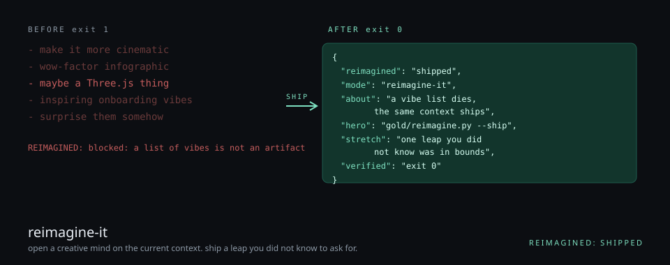
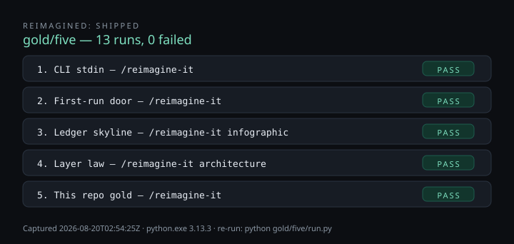
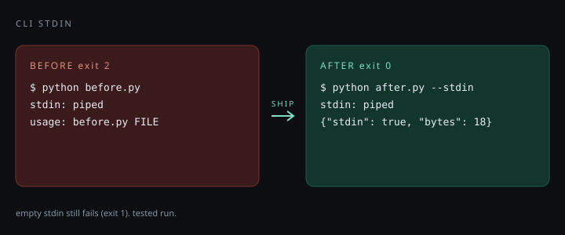
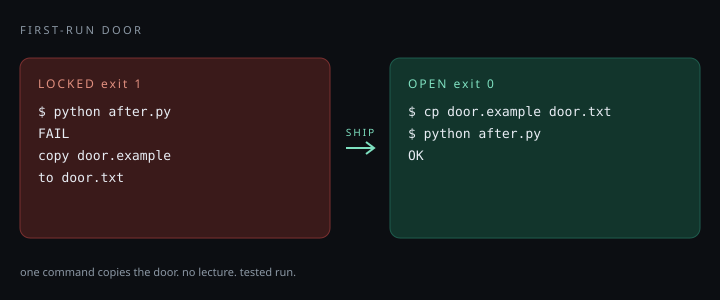
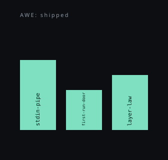
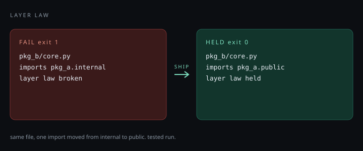
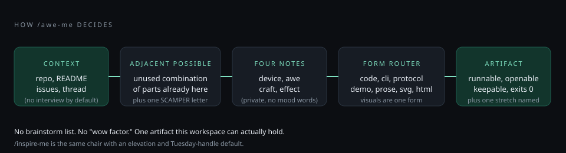

# awe-me

[](LICENSE) [](https://agentskills.io/specification) [](gold/five/RESULTS.md)



An [Agent Skill](https://agentskills.io) that opens a **creative mind** on the current context and ships a leap the user did not know to ask for.

Awe is not a graphics mode. `/awe-me` can invent a feature, CLI, protocol, architecture, demo, product move, experiment, prose, *or* a visual — whichever this workspace can actually hold.

```bash
npx skills add kazimrmerchant/awe-me
```

Global install (Cursor, Claude Code, and other hosts the CLI knows):

```bash
npx skills add kazimrmerchant/awe-me -g
```

Then say **awe me**, **inspire me**, `/awe-me`, or `/inspire-me`.

## What one command looks like

Take a normal plain user page. Run `/awe-me webpage`. Same words. Same three projects. Same email. One command later:


Both files live in [`gold/webpage/`](gold/webpage/) so you can double-click them. Re-shoot: `python gold/webpage/run.py` (writes `before.png`, `after.png`, and `compare.png` from live headless renders — no third-party service). The design rules the skill follows to hit that bar live in [`skills/awe-me/references/webpage-craft.md`](skills/awe-me/references/webpage-craft.md) — non-negotiable checklist, not vibes.

## Tested (5)

Live captures, not stories. Suite exit `0` (`failed=0`). Re-run: `python gold/five/run.py`. Every SVG under every example — the suite badge here, the pipe under §1, the door under §2, the skyline under §3, the layer graph under §4 — is rewritten by that same run from the row it captured. Example §5 is the hero at the top.



### 1. CLI stdin — `/awe-me`

Pipe into a file-only CLI (before), then `--stdin` (after). Empty stdin still fails.

```text
$ python before.py
cwd: gold/five/01-cli
stdin: piped
exit: 2 (expect 2) PASS
usage: before.py FILE
```

```text
$ python after.py --stdin
cwd: gold/five/01-cli
stdin: piped
exit: 0 (expect 0) PASS
{"stdin": true, "bytes": 18}
```

```text
$ python after.py --stdin
cwd: gold/five/01-cli
stdin: piped
exit: 1 (expect 1) PASS
empty stdin
```



### 2. First-run door — `/inspire-me`

Lecture (before). Same checker red until `door.example` is copied, then green.

```text
$ python before.py
cwd: gold/five/02-door
exit: 1 (expect 1) PASS
Welcome to Local MCP.
Please read the architecture notes, then the security notes, then ask Slack.
first-run: no command to copy. exit 1
```

```text
$ python after.py
cwd: gold/five/02-door
exit: 1 (expect 1) PASS
FAIL
broken: copy door.example to door.txt then re-run
```

```text
$ python after.py
cwd: gold/five/02-door
exit: 0 (expect 0) PASS
OK
```



### 3. Ledger skyline — `/awe-me infographic`

Same three JSONL titles: dump (before), then `index.html` contains all three (after).

```text
$ python before.py
cwd: gold/five/03-ledger
exit: 0 (expect 0) PASS
{"kind":"pr","title":"stdin-pipe"}
{"kind":"docs","title":"first-run-door"}
{"kind":"arch","title":"layer-law"}
```

```text
$ python after.py
cwd: gold/five/03-ledger
exit: 0 (expect 0) PASS
wrote index.html rows=3
```

```text
$ python assert titles in index.html
cwd: gold/five/03-ledger
exit: 0 (expect 0) PASS
all three titles present
```



### 4. Layer law — `/awe-me architecture`

`check.py` red on `pkg_a.internal`, green after `pkg_a.public`.

```text
$ python check.py
cwd: gold/five/04-layers
exit: 1 (expect 1) PASS
FAIL: pkg_b/core.py imports pkg_a.internal
```

```text
$ python check.py
cwd: gold/five/04-layers
exit: 0 (expect 0) PASS
OK: layer law held
```



### 5. This repo gold — `/awe-me`

```text
$ python awe.py --fail
cwd: gold
exit: 1 (expect 1) PASS
- make it more cinematic
- wow-factor infographic
- maybe a Three.js thing
- inspiring onboarding vibes
- surprise them somehow
AWE: blocked — a list of vibes is not an artifact
```

```text
$ python awe.py --ship
cwd: gold
exit: 0 (expect 0) PASS
{
  "awe": "shipped",
  "mode": "awe-me",
  "about": "A stranger sees a vibe list die, then the same context as one proving command.",
  "hero": "gold/awe.py --ship",
  "stretch": "npx skills add kazimrmerchant/skill-slice --skill awe-me",
  "verified": "this command exits 0; gold/awe.py --fail exits 1"
}
```

## Try

A reverse demo is included. A brainstorm fails; the same context ships:

```text
python gold/awe.py          # exit 1 — vibe list
python gold/awe.py --ship   # exit 0 — gold/shipped.json
```

Or open `gold/index.html`. That is the door, not a lecture.

```powershell
./gold/test_awe.ps1
```

## What it does



1. Sniffs the repo and thread (does not stall for a brief).
2. Names the **adjacent possible** — a combination of spare parts already here.
3. Picks four private notes (device · awe · craft · effect) and **one** SCAMPER letter.
4. Routes a **form** from context, unless you forced a category.
5. Ships an **artifact** you can run, open, or keep. Always names a **stretch**.

`/inspire-me` is the same chair with a different default: elevation + a Tuesday handle, not vastness-as-magnet.

Interview is **optional**. You opt in with `interview`. The agent decides the questions (one at a time, with a recommended answer). Default is no interview.

## Categories

You choose the token. The agent decides the rest.

| You type | Meaning |
|----------|---------|
| `/awe-me` | Infer and build |
| `/awe-me interview` | Talk, then build |
| `/awe-me code` `cli` `protocol` `demo` `prose` `product` `architecture` `experiment` | Force a form family |
| `/awe-me svg` `3js` `infographic` `canvas` `html` | Force a visual |
| `/awe-me --notes` | Include the four notes in the report |
| `/awe-me --plan-only` | Lock + notes + form; no files |
| `/awe-me --full` | Plus-pass after the hero (one mutation, no restart) |
| `/awe-me interview cli` | Combine freely |

## Install without the CLI

Copy **one** folder. The skill directory name must stay `awe-me`.

```powershell
git clone https://github.com/kazimrmerchant/awe-me.git
Copy-Item -Recurse .\awe-me\skills\awe-me $env:USERPROFILE\.cursor\skills\
```

Other hosts: copy `skills/awe-me/` into that product’s skills root (`SKILL.md` required). Never install into `~/.cursor/skills-cursor/` (Cursor-managed built-ins).

Optional Cursor slashes: copy `commands/awe-me.md` and `commands/inspire-me.md` into `~/.cursor/commands/`.

## What this is not

- Not a brainstorm list or a mood-word grill
- Not [grill-me](https://github.com/mattpocock/skills) (that is a feasibility interview)
- Not `/better` (quality pass on an existing deliverable)
- Not “make it pop” / wow-factor as a strategy
- Not an image generator unless you explicitly ask your host for that

## Layout

```
skills/awe-me/          # the skill (copy this folder)
skills/awe-me/references/webpage-craft.md  # non-negotiable rules for /awe-me webpage
gold/                   # reverse-demo: fail list, then --ship
gold/hero.svg           # the metaphor (before/after) - the image at the top
gold/webpage/           # plain page vs redesigned page; python gold/webpage/run.py
gold/webpage/compare.png # the side-by-side embedded near the top
gold/five/              # five tested fixtures; python gold/five/run.py
gold/five/RUN.svg       # suite badge, regenerated by run.py
gold/five/01-cli/pipe.svg      # regenerated by run.py from fixture 1
gold/five/02-door/door.svg     # regenerated by run.py from fixture 2
gold/five/03-ledger/index.svg  # regenerated by run.py from fixture 3
gold/five/04-layers/layers.svg # regenerated by run.py from fixture 4
docs/flow.svg           # how /awe-me decides (also shown above)
commands/               # optional Cursor slash files
```

Every visual in this README is either static SVG in this repo or output that `python gold/five/run.py` rewrites. Nothing rendered by a third-party service.

Spec: [agentskills.io](https://agentskills.io/specification). Progressive disclosure: description is the trigger; body loads when the task matches; `references/` load on demand.

## Lineage (methods, not a brand)

Make-strange (Shklovsky, 1917). Adjacent possible (Kauffman; Johnson). SCAMPER (Eberle after Osborn). Awe as vastness + accommodation (Keltner & Haidt). Peak–end. Disney plussing. Pixar-shaped notes. Effect-before-method as craft. See [NOTICE](NOTICE).

## License

MIT. See [LICENSE](LICENSE).
