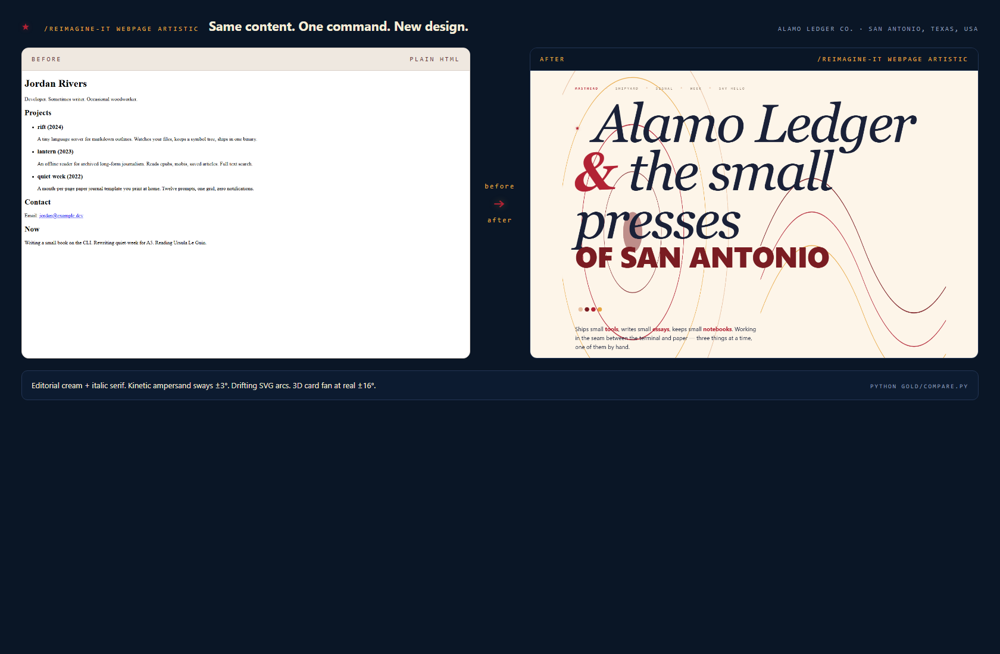
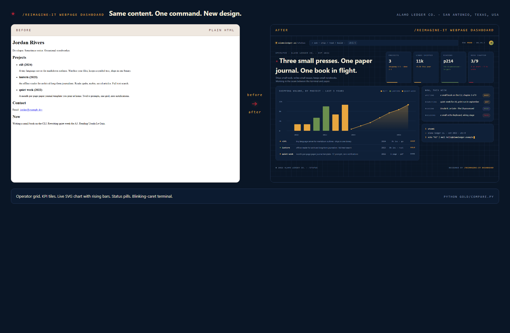
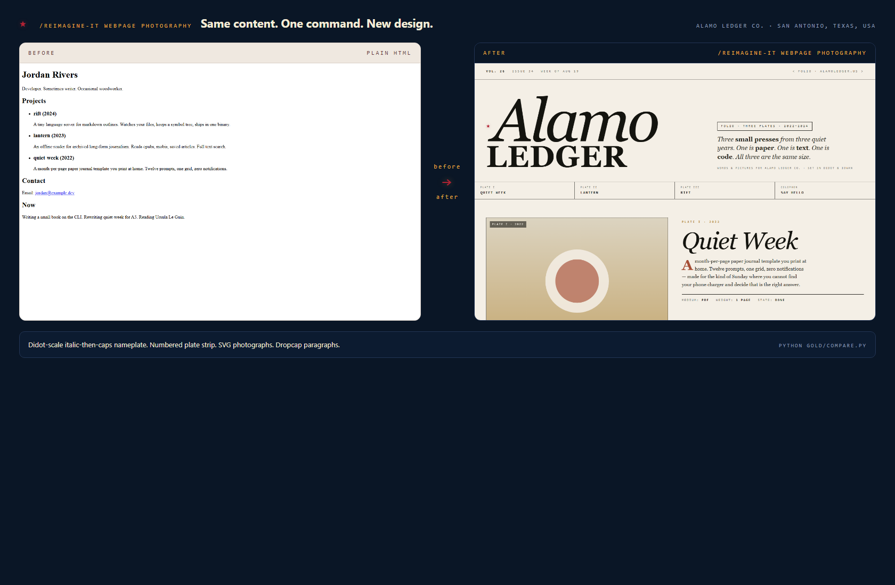
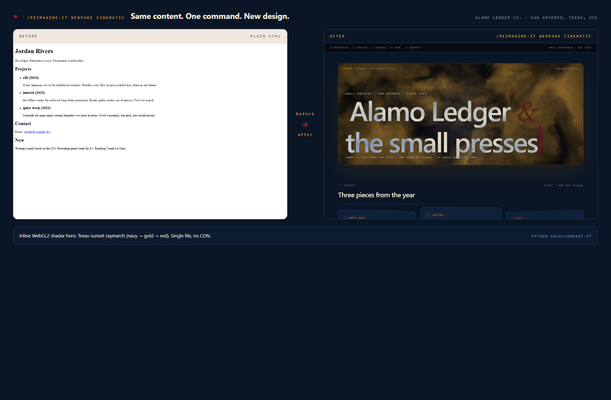
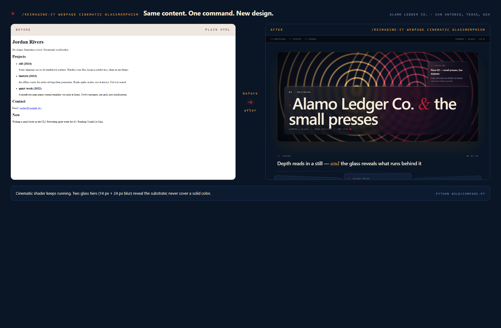
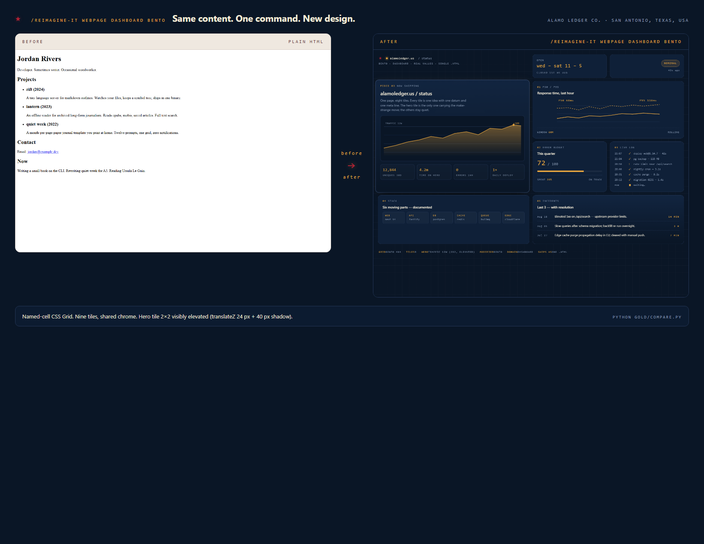
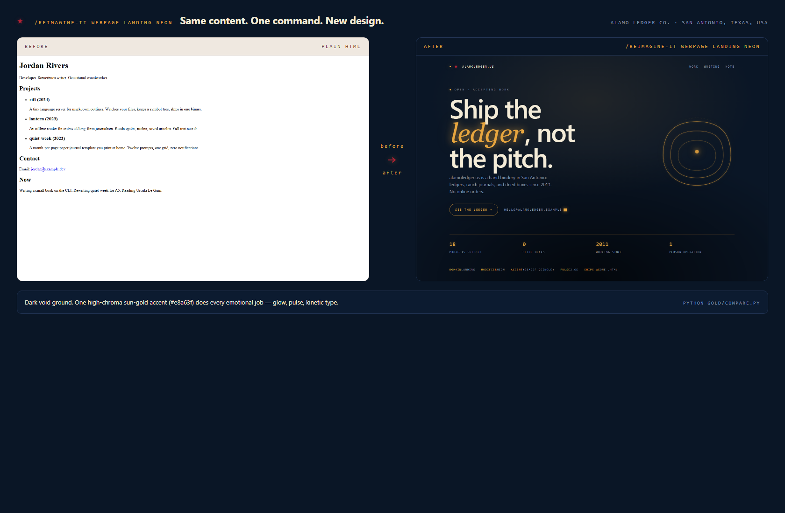

# reimagine-it

[](LICENSE) [](https://agentskills.io/specification) [](skills/reimagine-it/SKILL.md) [](https://github.com/sponsors/kazimrmerchant)

> Same brief, radically different output. One agent skill that takes any file — a webpage, PDF, deck, doc, CLI, protocol, prose — and ships a leap the user didn't know to ask for.
>
> The gallery below is built entirely from the same naive HTML page, redesigned eight different ways by the same command with one different token each. Every shot renders locally from a real `.html` file in this repo. No CDN, no paid API, no third-party service.
>
> Theme: the sample brand across every gold example below is a fictional hand bindery — **Alamo Ledger Co.**, San Antonio, **Texas, USA**. Palette anchors on Lone-Star night navy, parchment cream, star red, and sun gold so eight radically different aesthetics still read as one design system.


```
/reimagine-it webpage                                        <- default (top-left)
/reimagine-it webpage artistic
/reimagine-it webpage dashboard
/reimagine-it webpage photography
/reimagine-it webpage cinematic                              <- inline WebGL2 shader
/reimagine-it webpage cinematic glassmorphism                <- modifier stacks on domain
/reimagine-it webpage dashboard bento
/reimagine-it webpage landing   neon
```

---

## Install

```bash
npx skills add kazimrmerchant/reimagine-it            # one project
npx skills add kazimrmerchant/reimagine-it -g          # global (Cursor, Claude Code, ...)
```

Then say `/reimagine-it` in your host.

---

## The five levers

| Lever | Syntax | Effect |
|-------|--------|--------|
| **Form** | `webpage` · `pdf` · `slides` · `document` · `code` · `cli` · `protocol` · ... | Force the medium. |
| **Domain** | `webpage artistic` · `dashboard` · `photography` · `cinematic` · `landing` · `portfolio` | Force the aesthetic. See [`references/domains/`](skills/reimagine-it/references/domains/). |
| **Modifier** | `webpage cinematic glassmorphism` · `bento` · `neon` · `brutalism` · `neumorphism` · `handdrawn` | Layer a UI/UX style on any domain. See [`references/modifiers/`](skills/reimagine-it/references/modifiers/). |
| **Font** | `--font "Playfair Display, Iowan Old Style, Georgia, serif"` | Pin display / body family. Full stack. No webfont fetch unless `--allow-fetch`. |
| **Lock** | `lock <path> as <name>` then `--ref <name>` | Capture design DNA (palette, type, motifs, motion, 3D) and reuse it — even across media. |

Compose freely: `/reimagine-it webpage artistic glassmorphism --font "Playfair Display, serif" --ref house-cinema`.

---

## Before → after, one command at a time

Every section below has the **same naive HTML on the left** (`gold/webpage/before.html` — a plain personal page: a name, three projects, one email) and the **/reimagine-it output on the right**. The only thing that changed between rows is the token you pass. Regenerate the whole set: `python gold/compare.py`.

### Default spine — `/reimagine-it webpage`

**Before:** a flat contact card in the browser default. Times New Roman, no hierarchy, no motion, no motif.
**After:** a designed page — 12-column grid, palette cap, KPI-style project tiles, one make-strange move at the bottom, honest chrome. Nothing added that isn't in the source content. See [`gold/webpage/after.html`](gold/webpage/after.html).


### `artistic` — `/reimagine-it webpage artistic`

**Before:** same naive page.
**After:** editorial cream + italic serif at hero scale. The ampersand sways ±3° on a slow cycle. Drifting SVG arcs behind the type. Cards fan out at real ±16° with a 40 px drop-shadow — the 3D reads in a still. See [`gold/domains/artistic/after.html`](gold/domains/artistic/after.html).



### `dashboard` — `/reimagine-it webpage dashboard`

**Before:** same naive page.
**After:** operator grid, KPI tiles across the top, a live SVG traffic chart with a rising-bar animation and a pulsing accent dot, status pills, and a blinking-caret terminal card. Reads as a real ops surface. See [`gold/domains/dashboard/after.html`](gold/domains/dashboard/after.html).



### `photography` — `/reimagine-it webpage photography`

**Before:** same naive page.
**After:** a magazine folio. Didot-scale italic-then-caps nameplate. Numbered plate strip. Three real SVG "photographs" (drawn on the page, not stock). Dropcap paragraphs. Deliberately quiet motion — a folio doesn't twitch. See [`gold/domains/photography/after.html`](gold/domains/photography/after.html).



### `cinematic` — `/reimagine-it webpage cinematic`

**Before:** same naive page.
**After:** an inline `<canvas>` + inline fragment shader (`<script type="x-shader/x-fragment">`) drawing a Texas-sunset raymarched interference field (navy → sun gold → star red). No CDN, no `import` from `https://`, no vendor folder. Masthead sits on top with `mix-blend-mode: difference` so type reads over any color the field draws. Cards below fan in real 3D. See [`gold/domains/cinematic/after.html`](gold/domains/cinematic/after.html).



### `cinematic` + `glassmorphism` — `/reimagine-it webpage cinematic glassmorphism`

**Before:** same naive page.
**After:** the cinematic shader keeps running. Glassmorphism layers a **front tier** (14 px blur) over the masthead and a **deep tier** (24 px blur) over a data tile. Light-source-consistent borders (bright top-left inset, dark bottom-right inset), colored `box-shadow`s. Blur **reveals** the substrate; it never covers a solid color. See [`gold/modifiers/cinematic-glassmorphism/after.html`](gold/modifiers/cinematic-glassmorphism/after.html).



### `dashboard` + `bento` — `/reimagine-it webpage dashboard bento`

**Before:** same naive page.
**After:** a named-cell CSS Grid with `grid-template-areas: "brand brand hours state" "hero hero chart chart" "hero hero latency logs" "stack stack incidents incidents"`. Nine tiles, unequal but shared chrome. Hero tile visibly elevated (`translateZ(24px)` + 40 px shadow). One idea per tile. See [`gold/modifiers/dashboard-bento/after.html`](gold/modifiers/dashboard-bento/after.html).



### `landing` + `neon` — `/reimagine-it webpage landing neon`

**Before:** same naive page.
**After:** a dark void ground with a single radial-gradient vignette. **One** high-chroma accent (`#e8a63f` — sun gold) doing every emotional job: the italic *ledger* word (kinetic — pulses letter-spacing on a 4 s cycle), the orbital SVG that draws itself on load, the CTA border, the blinking cursor. Glow via double `drop-shadow`. See [`gold/modifiers/landing-neon/after.html`](gold/modifiers/landing-neon/after.html).



---

## Motion is real (three frames per pack)

Screenshots freeze animation, so every claim about motion proves itself in a strip. Three frames per pack, spaced ~1.6 s apart in virtual time — if the pixels change, the motion budget landed:


- **cinematic** — WebGL2 raymarch field evolves visibly frame to frame.
- **artistic** — italic ampersand sways ±3°.
- **dashboard** — chart bars rise into place between frames.
- **photography** — deliberately still.

---

## Not just webpages — PDF · document · slides · anything

Point at any file. Force any output:

| Token | Pack | Regenerator |
|-------|------|-------------|
| `pdf` | [forms/pdf.md](skills/reimagine-it/references/forms/pdf.md) | Weasyprint (HTML → PDF) or ReportLab (print-native Python) |
| `document` / `docx` / `md` | [forms/document.md](skills/reimagine-it/references/forms/document.md) | python-docx, pandoc, or LaTeX |
| `slides` / `pptx` / `deck` | [forms/slides.md](skills/reimagine-it/references/forms/slides.md) | python-pptx or reveal.js |
| `universal` | [forms/universal.md](skills/reimagine-it/references/forms/universal.md) | Detects file type, dispatches, or writes a companion overlay |

Every non-web pack keeps the same bar: cover magnet, one data-driven plate, one repeating motif, one make-strange move, real content from *your* file. All regenerators are free, offline, locally installable.

---

## Lock — capture a shipped design, reuse it anywhere

Once a design lands, save its DNA:

```
/reimagine-it lock gold/domains/cinematic/after.html as house-cinema
```

The skill extracts palette + type stack + motifs + motion + 3D + section structure into a markdown pack under [`references/locks/`](skills/reimagine-it/references/locks/). Example: [`house-cinema.md`](skills/reimagine-it/references/locks/house-cinema.md).

Apply a lock to a new target — **same medium or a different one**:

```
/reimagine-it webpage --ref house-cinema
/reimagine-it slides  --ref house-cinema
/reimagine-it pdf     --ref house-cinema
```

Locks include a **cross-medium translation table** so a webpage lock informs a slides deck or a PDF (a `rotateY(9deg) translateZ(-8px)` card becomes a pptx panel with paired shadows; a WebGL shader hero becomes a snapshot PNG cover). Locks are portable text — share via gist, commit, or copy-paste.

---

## Everything on this page is tested

Every visual is a real file in this repo, generated locally by a script you can rerun:

| Regenerates | Command |
|-------------|---------|
| Master gallery (`gold/gallery.png`) + per-pack heroes | `python gold/gallery.py` |
| Per-pack before/after compares (`<pack>/compare.png`) | `python gold/compare.py` |
| Default before + after screenshots (`gold/webpage/*.png`) | `python gold/webpage/run.py` |
| Motion strip (`gold/domains/motion-strip.png`) | `python gold/domains/motion-run.py` |
| Skill smoke fixture (`gold/reimagine.py`) | `python gold/reimagine.py --ship` |
| Texas theme sweep across every gold `.html` (idempotent) | `python gold/theme_texas.py` |

If a regenerator fails on your machine, that's a bug — please open an issue. Nothing on this page is rendered by a third-party service or fetched from a CDN.

---

## If this helps you

If `/reimagine-it` gives you an output you'd have paid a designer for, three ways to help me keep shipping the next domains, form packs, and locks:

- **Star the repo.** It's the single fastest signal that this project should keep growing. Use the star button at the top of the page.
- **[Sponsor on GitHub &rarr;](https://github.com/sponsors/kazimrmerchant)** Any tier keeps the studio's lights on. Sponsors get priority on custom domain packs and roadmap input.
- **Contribute a domain or a lock.** Open a PR under [`skills/reimagine-it/references/domains/`](skills/reimagine-it/references/domains/) or [`references/locks/`](skills/reimagine-it/references/locks/). Real content beats a spec.

Say hi on [GitHub](https://github.com/kazimrmerchant).

---

MIT licensed — see [LICENSE](LICENSE). Skill spec: [agentskills.io](https://agentskills.io/specification).
