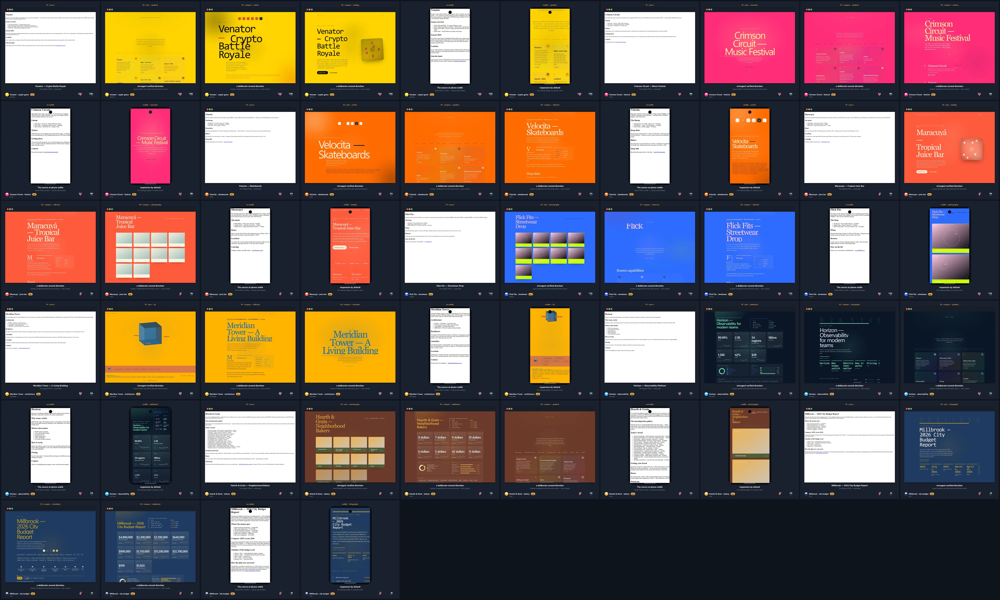

# See the transformation, not the template

These examples show seven genuinely different jobs: running a crypto battle royale, throwing a music festival, selling skateboards, pouring juice, dropping streetwear, building a living tower, and running an observability platform. Each starts as plain HTML and becomes a standalone page whose layout, palette, and rhythm follow the source — on a desktop window and on a phone. The palettes are loud on purpose: each source carries its own hex colors (signal yellow, magenta, flame orange, mango coral, electric blue, amber, signal cyan), and the engine uses them directly.



## A fast way to judge the result

Open the source first, then open **Auto**, then open the two generated options. Ask three questions:

- Did the page keep the facts and useful links?
- Does the composition fit the subject rather than merely change colors?
- Would a real person know what to read or do next?

| Example | Source → Auto | Two more options | Why it is here |
|---|---|---|---|
| [Venator](venator/) | crypto battle royale → `dashboard` | `landing`, `artistic` | gaming language gets a signal-yellow arena instead of a timeline scrubber |
| [Crimson Circuit](crimson-circuit/) | music festival → `infographic` | `gradient`, `landing` | lineup counts and set times become a magenta statistical poster |
| [Velocita](velocita/) | skate brand → `infographic` | `artistic`, `landing` | drop-date urgency gets a flame-orange gradient deck |
| [Maracuyá](maracuya/) | juice bar → `infographic` | `landing`, `gradient` | menu facts get shared scales on mango coral |
| [Flick Fits](flick/) | streetwear → `infographic` | `landing`, `gradient` | drop counts and SKUs become a blue unit-count wall |
| [Meridian Tower](meridian/) | living building → `editorial` | `3js`, `svg` | one command ships three furnished designs: a feature, an orbitable 3D object, and a living diagram |
| [Horizon](horizon/) | observability → `infographic` | `gradient`, `landing` | SLOs and latency numbers become a data wall on navy |

**One command, three furnished designs** — on a building page, `npx reimagine-it --auto -i meridian.html` produces the Auto-selected editorial feature **plus** an orbitable 3D object (`3js`) and a living SVG diagram (`svg`) from the same source. Static renders of the orbit and the diagram live in `meridian/3js-desktop.webp` and `meridian/svg-desktop.webp`.

## Run one yourself

```bash
npm run auto -- \
  -i examples/end-users/venator/source.html \
  -o /tmp/venator.html \
  --report /tmp/venator.json \
  --seed 57
```

Open `/tmp/venator.html`, then inspect `/tmp/venator.json`. The report explains the selected direction and records the source-fidelity checks. Your source file is never overwritten.

Auto also writes two verified alternatives beside the selected result:

```text
reimagined/auto.html
reimagined/auto-options/02-landing.html
reimagined/auto-options/03-artistic.html
```

To compare a deliberate option yourself:

```bash
npx reimagine-it \
  -i examples/end-users/venator/source.html \
  -t landing \
  -o /tmp/venator-alternate.html \
  --seed 57
```

## What each before/after image shows

Each `before-after.webp` is a single static composite — the source on the left, the strongest verified redesign on the right, joined by a gold arrow. It loads in one request and makes the transformation visible at a glance:

- [Venator](venator/before-after.webp) — battle royale → signal-yellow arena + two alternatives, desktop and phone
- [Crimson Circuit](crimson-circuit/before-after.webp) — festival → magenta infographic poster + two alternatives, desktop and phone
- [Velocita](velocita/before-after.webp) — skate brand → flame-orange infographic deck + two alternatives, desktop and phone
- [Maracuyá](maracuya/before-after.webp) — juice bar → coral infographic menu + two alternatives, desktop and phone
- [Flick Fits](flick/before-after.webp) — streetwear → electric-blue infographic drop + two alternatives, desktop and phone
- [Meridian Tower](meridian/before-after.webp) — building → amber editorial feature + 3js orbit and svg diagram
- [Horizon](horizon/before-after.webp) — observability → navy infographic dashboard + two alternatives
- [All seven](gallery.webp) — the complete grid

The images are generated by `build.py`; they are proof of a reproducible transformation, not the final deliverable. For the usable result, open the linked `auto.html` file.

## Change the source

Replace any `source.html`, run `npm run examples`, and review both the artifact and its report before sharing it with a client. Keep the seed when you want an approved result to remain reproducible; change the token only when you intentionally want a different composition. To steer a palette, write the hex colors you want into the source text — the engine reads them and builds the palette from them.
