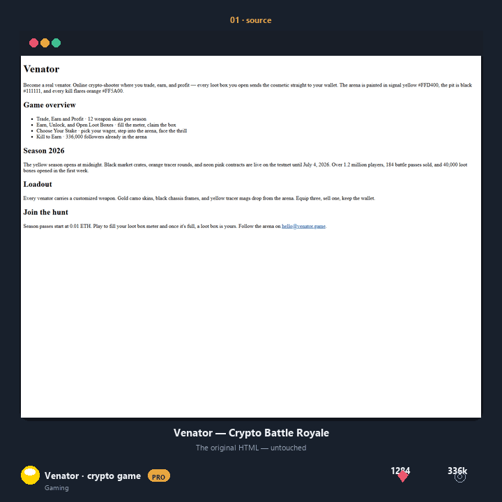

# See the transformation, not the template

These examples show three genuinely different jobs: operating a release, welcoming a dinner guest, and telling a quiet story. Each starts as plain HTML and becomes a standalone page whose layout, palette, and rhythm follow the source.



## A fast way to judge the result

Open the source first, then open **Auto**, then open the two generated options. Ask three questions:

- Did the page keep the facts and useful links?
- Does the composition fit the subject rather than merely change colors?
- Would a real person know what to read or do next?

| Example | Source → Auto | Two more options | Why it is here |
|---|---|---|---|
| [Orbitline Release Desk](orbitline/) | operational notes → `dashboard` | `infographic`, `webpage` | dense status information gets hierarchy and scan paths |
| [Ember &amp; Table](ember-table/) | seasonal menu → `webpage` | `photography`, `landing` | food language gets warmth without fake food imagery |
| [A Letter to the Night Tide](tide-letter/) | essay → `cinematic` | `artistic`, `simulation` | narrative content gets pacing and room to breathe |

## Run one yourself

```bash
npm run auto -- \
  -i examples/end-users/orbitline/source.html \
  -o /tmp/orbitline.html \
  --report /tmp/orbitline.json \
  --seed 11
```

Open `/tmp/orbitline.html`, then inspect `/tmp/orbitline.json`. The report explains the selected direction and records the source-fidelity checks. Your source file is never overwritten.

Auto also writes two verified alternatives beside the selected result:

```text
reimagined/auto.html
reimagined/auto-options/02-infographic.html
reimagined/auto-options/03-webpage.html
```

To compare a deliberate option yourself:

```bash
npx reimagine-it \
  -i examples/end-users/orbitline/source.html \
  -t infographic \
  -o /tmp/orbitline-alternate.html \
  --seed 11
```

## What each GIF means

Every GIF uses the same three beats:

1. **Source** — the original HTML as a browser renders it.
2. **Auto** — the strongest verified direction selected from the source evidence.
3. **Options** — two different compositions, not recolored duplicates.

- [Orbitline](orbitline/before-after.gif) — release desk → selected console → two alternatives
- [Ember &amp; Table](ember-table/before-after.gif) — menu → selected service page → two alternatives
- [Night Tide](tide-letter/before-after.gif) — essay → selected narrative field → two alternatives
- [All three](gallery.gif) — the complete short loop

The GIFs are generated by `build.py`; they are proof of a reproducible transformation, not the final deliverable. For the usable result, open the linked `auto.html` file.

## Change the source

Replace any `source.html`, run `npm run examples`, and review both the artifact and its report before sharing it with a client. Keep the seed when you want an approved result to remain reproducible; change the token only when you intentionally want a different composition.
