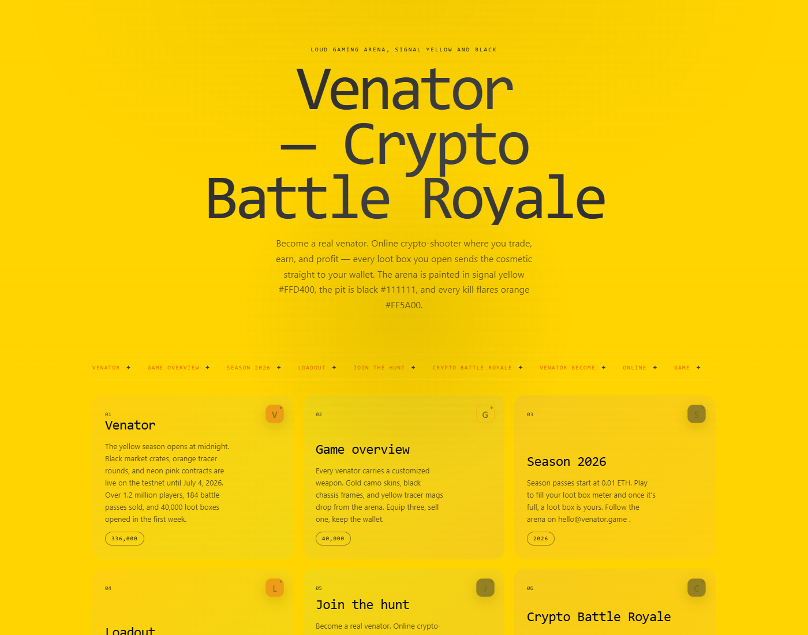
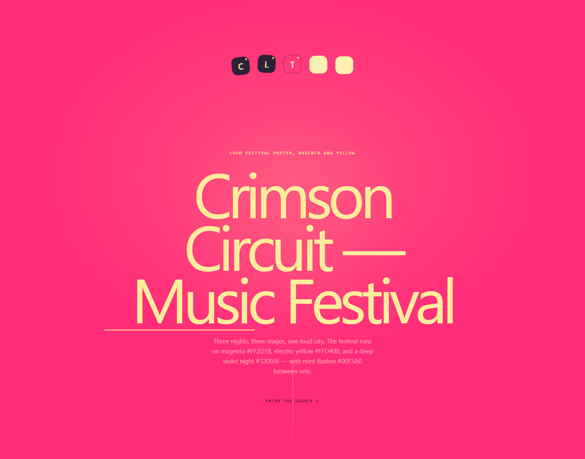
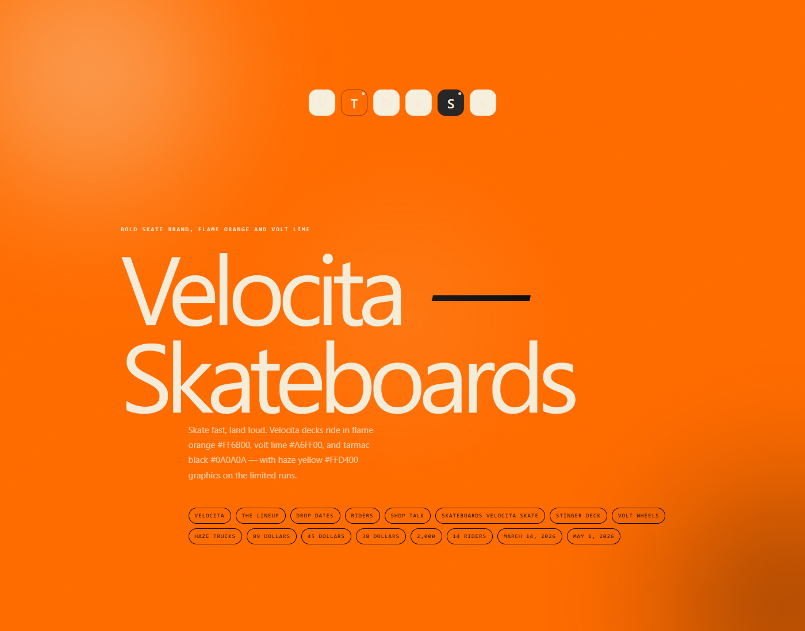
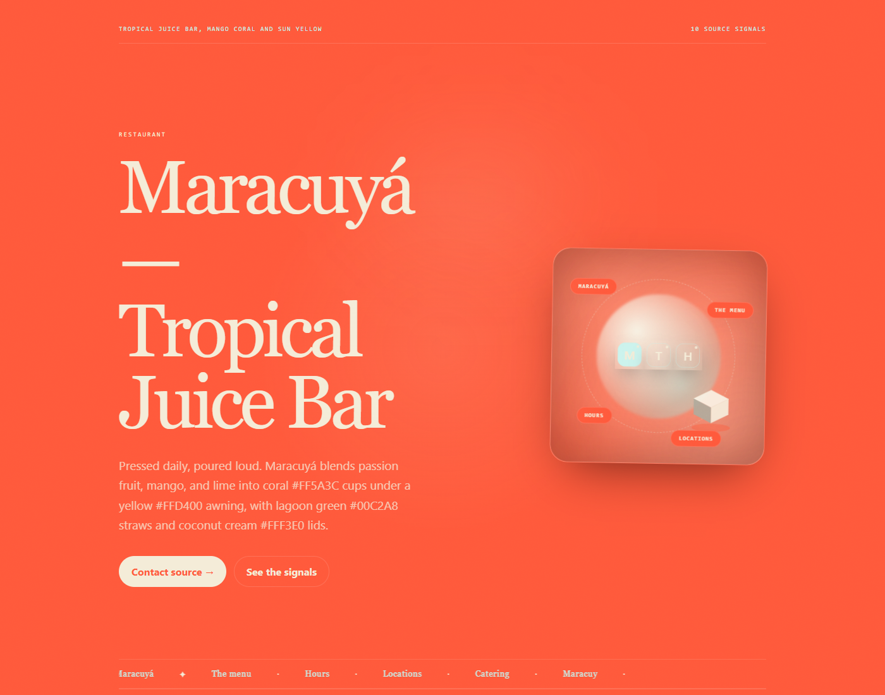
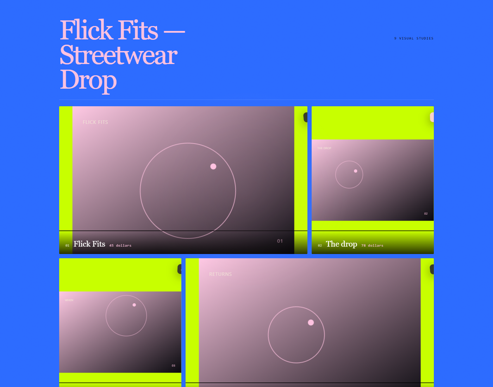
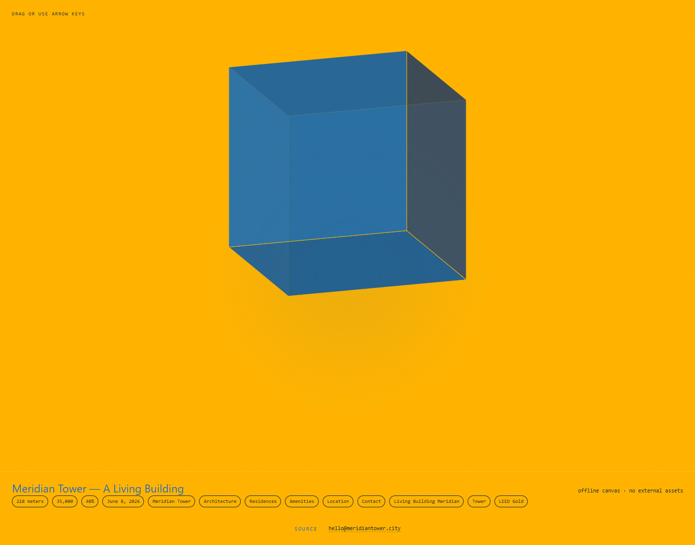
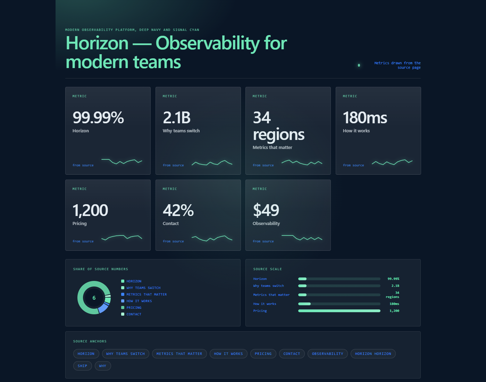
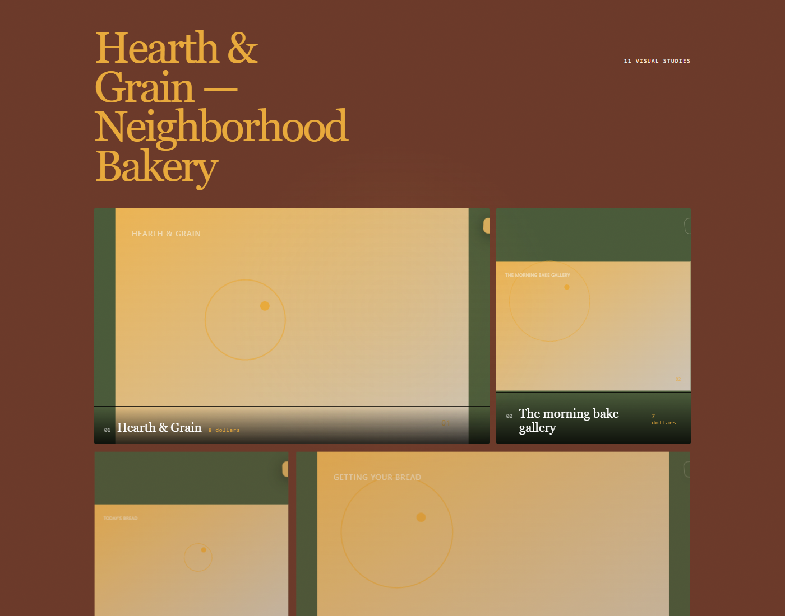
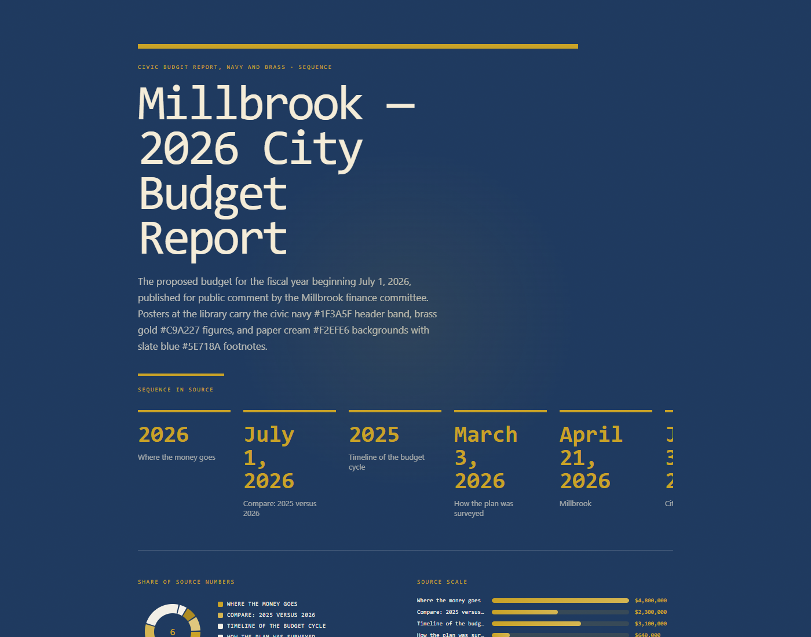

# See the transformation, not the template

These examples show nine genuinely different jobs: running a crypto battle royale, throwing a music festival, selling skateboards, pouring juice, dropping streetwear, building a living tower, running an observability platform, baking the morning loaves, and publishing a city budget. The seven launch journeys each own a distinct token — `gradient`, `cinematic`, `artistic`, `landing`, `photography`, `3js`, `dashboard` — so a juice bar, a skate deck, and a streetwear drop cannot collapse onto one poster. The two newest prove the v2.6.0 guarantees from the other side: the bakery's collection page lands a **photography** folio (a real job the launch set did not cover) instead of a data poster, and the budget's comparison/timeline language lands an **infographic** whose first fold is the source's own timeline. Each starts as plain HTML and becomes a standalone page whose layout, palette, and rhythm follow the source. The palettes are loud on purpose: each source carries its own hex colors (signal yellow, magenta, flame orange, mango coral, electric blue, amber, signal cyan, crust brown and butter gold, civic navy and brass), and the engine uses them directly.


## Auto results — nine sources, distinct silhouettes

These are the Auto desktops GitHub Pages ships. Same engine, seed-locked in each `auto.json`.

<p align="center">
  
  
  
  
  
  
  
  
  
</p>

## A fast way to judge the result

Open the source first, then open **Auto**, then open the two generated options. Ask three questions:

- Did the page keep the facts and useful links?
- Does the composition fit the subject rather than merely change colors?
- Would a real person know what to read or do next?

| Example | Source → Auto | Score | Two more options | Why it is here |
|---|---|---|---|---|
| [Venator](venator/) | crypto battle royale → `gradient` | 246 | `landing`, `artistic` | gaming language gets a signal-yellow gradient arena instead of a timeline scrubber |
| [Crimson Circuit](crimson-circuit/) | music festival → `cinematic` | 258 | `gradient`, `landing` | three nights become a magenta cinematic scroll, not a bar chart |
| [Velocita](velocita/) | skate brand → `artistic` | 240 | `gradient`, `landing` | decks and riders become an expressive type poster |
| [Maracuyá](maracuya/) | juice bar → `landing` | 246 | `photography`, `gradient` | the menu becomes a product landing with a real source action |
| [Flick Fits](flick/) | streetwear → `photography` | 250 | `showcase`, `landing` | the drop becomes a photography folio of garment studies |
| [Meridian Tower](meridian/) | living building → `3js` | 260 | `editorial`, `svg` | one command ships three furnished designs: an orbitable 3D object, a magazine feature, and a living diagram |
| [Horizon](horizon/) | observability → `dashboard` | 330 | `gradient`, `landing` | SLOs and latency numbers become an ops dashboard |
| [Hearth & Grain](hearth-grain/) | bakery → `photography` | 226 | `landing`, `editorial` | sixteen loaves become a photography folio of the morning bake, not a data poster |
| [Millbrook](millbrook-budget/) | city budget → `infographic` | 278 | `simulation`, `editorial` | comparison, timeline, and survey language becomes an infographic whose first fold is the budget timeline |

**One command, three furnished designs** — on a building page, `npx reimagine-it --auto -i meridian.html` produces the Auto-selected 3D object **plus** a magazine feature (`editorial`) and a living SVG diagram (`svg`) from the same source. Static renders of the orbit, the feature, and the diagram live in `meridian/3js-desktop.webp`, `meridian/editorial-desktop.webp`, and `meridian/svg-desktop.webp`.

## Run one yourself

```bash
npm run auto -- \
  -i examples/end-users/venator/source.html \
  -o /tmp/venator.html \
  --report /tmp/venator.json \
  --seed 57
```

Open `/tmp/venator.html`, then inspect `/tmp/venator.json`. The report explains the selected direction and records the source-fidelity checks. Your source file is never overwritten.

Auto also writes two verified alternatives beside the selected result:

```text
reimagined/auto.html
reimagined/auto-options/02-landing.html
reimagined/auto-options/03-artistic.html
```

To compare a deliberate option yourself:

```bash
npx reimagine-it \
  -i examples/end-users/venator/source.html \
  -t landing \
  -o /tmp/venator-alternate.html \
  --seed 57
```

## What each before/after image shows

Each `before-after.webp` is a single static composite — the source on the left, the strongest verified redesign on the right, joined by a gold arrow. It loads in one request and makes the transformation visible at a glance:

- [Venator](venator/before-after.webp) — battle royale → signal-yellow gradient arena + two alternatives, desktop and phone
- [Crimson Circuit](crimson-circuit/before-after.webp) — festival → magenta cinematic chapters + two alternatives, desktop and phone
- [Velocita](velocita/before-after.webp) — skate brand → flame-orange artistic poster + two alternatives, desktop and phone
- [Maracuyá](maracuya/before-after.webp) — juice bar → coral product landing + two alternatives, desktop and phone
- [Flick Fits](flick/before-after.webp) — streetwear → electric-blue photography folio + two alternatives, desktop and phone
- [Meridian Tower](meridian/before-after.webp) — building → amber 3D object + editorial feature and svg diagram
- [Horizon](horizon/before-after.webp) — observability → navy ops dashboard + two alternatives
- [Hearth & Grain](hearth-grain/before-after.webp) — bakery → crust-brown photography folio + two alternatives
- [Millbrook](millbrook-budget/before-after.webp) — city budget → navy-and-brass infographic timeline + two alternatives
- [All nine](gallery.webp) — the complete grid

The images are generated by `build.py`; they are proof of a reproducible transformation, not the final deliverable. For the usable result, open the linked `auto.html` file.

## Change the source

Replace any `source.html`, run `npm run examples`, and review both the artifact and its report before sharing it with a client. Keep the seed when you want an approved result to remain reproducible; change the token only when you intentionally want a different composition. To steer a palette, write the hex colors you want into the source text — the engine reads them and builds the palette from them.
