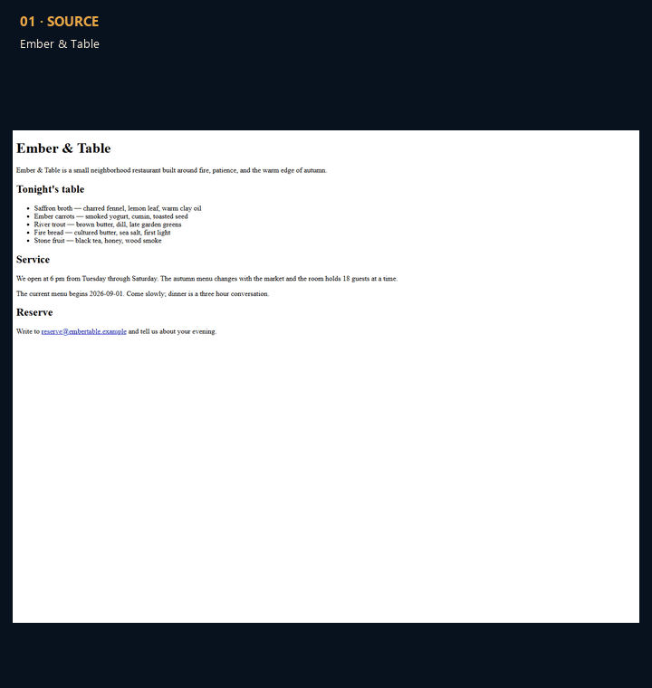

# Case study — Ember & Table

## The job
seasonal menu → **`landing`** (Auto selection, score **160**)

> The source has an outward-facing action or product-like structure. Evidence: 5 anchors, 1 measurable facts.

## Reproduce it

```bash
npm run auto --   -i examples/end-users/ember-table/source.html   -o /tmp/ember-table.html   --report /tmp/ember-table.json   --seed 11
```

Open `/tmp/ember-table.html` and inspect `/tmp/ember-table.json`. The seed is fixed so the output is bit-for-bit reproducible; your own source file is never overwritten.

## Bundle contents

| File | What it is |
|---|---|
| [source.html](source.html) | the plain HTML input |
| [auto.html](auto.html) | Auto-selected output — `landing` |
| [before-after.gif](before-after.gif) | proof on desktop and phone |
| [auto.json](auto.json) | full Auto report (rationale, candidates, fidelity) |

## Alternatives

- [option 2-photography](option-2-photography.html)
- [option 3-cinematic](option-3-cinematic.html)
- [option 3-landing](option-3-landing.html)

## Proof



## Report highlights

- **Quality checks:** 8/8 passed (standalone HTML, title preserved, anchors retained, focus-visible, reduced motion, selection styling, no placeholder copy, no external fetch).
- **Source fidelity:** 77% — 10 of 13 detected source elements preserved.
- **Why it is here:** food language gets warmth without fake food imagery
