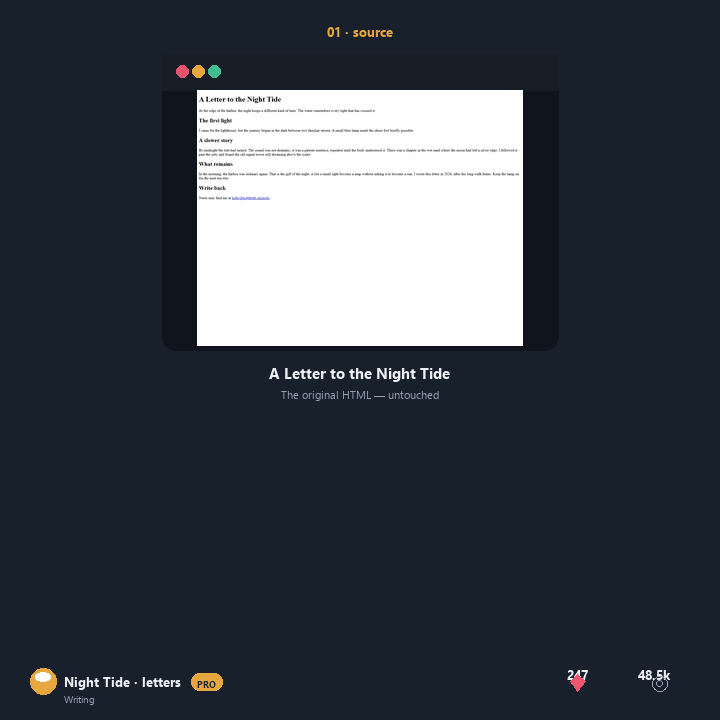

# Case study — A Letter to the Night Tide

## The job
personal essay → **`editorial`** (Auto selection, score **182**)

> The source has enough text for a magazine-grade treatment. Evidence: 5 anchors, 1 measurable facts.

## Reproduce it

```bash
npm run auto --   -i examples/end-users/tide-letter/source.html   -o /tmp/tide-letter.html   --report /tmp/tide-letter.json   --seed 11
```

Open `/tmp/tide-letter.html` and inspect `/tmp/tide-letter.json`. The seed is fixed so the output is bit-for-bit reproducible; your own source file is never overwritten.

## Bundle contents

| File | What it is |
|---|---|
| [source.html](source.html) | the plain HTML input |
| [auto.html](auto.html) | Auto-selected output — `editorial` |
| [before-after.gif](before-after.gif) | proof on desktop and phone |
| [auto.json](auto.json) | full Auto report (rationale, candidates, fidelity) |

## Alternatives

- [option 2-artistic](option-2-artistic.html)
- [option 3-simulation](option-3-simulation.html)

## Proof



## Report highlights

- **Quality checks:** 8/8 passed (standalone HTML, title preserved, anchors retained, focus-visible, reduced motion, selection styling, no placeholder copy, no external fetch).
- **Source fidelity:** 86% — 12 of 14 detected source elements preserved.
- **Why it is here:** narrative content gets a magazine treatment
